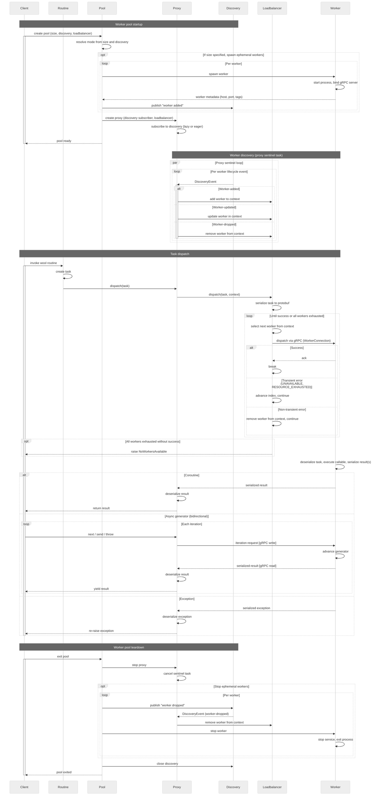
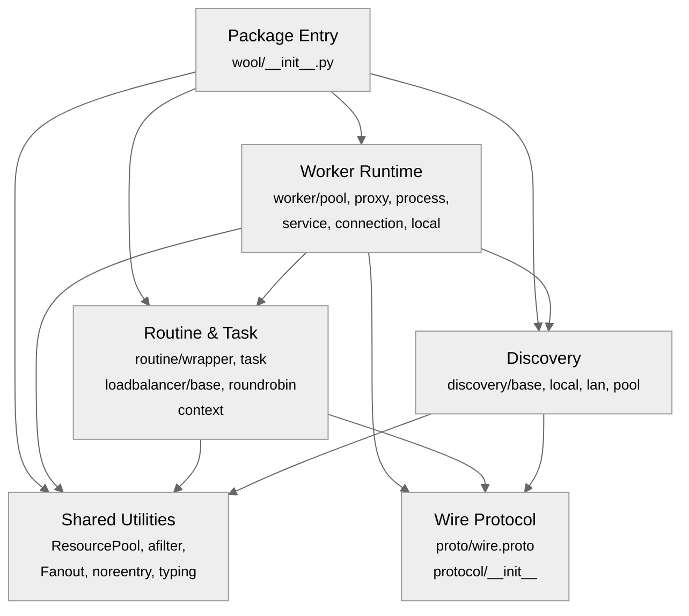
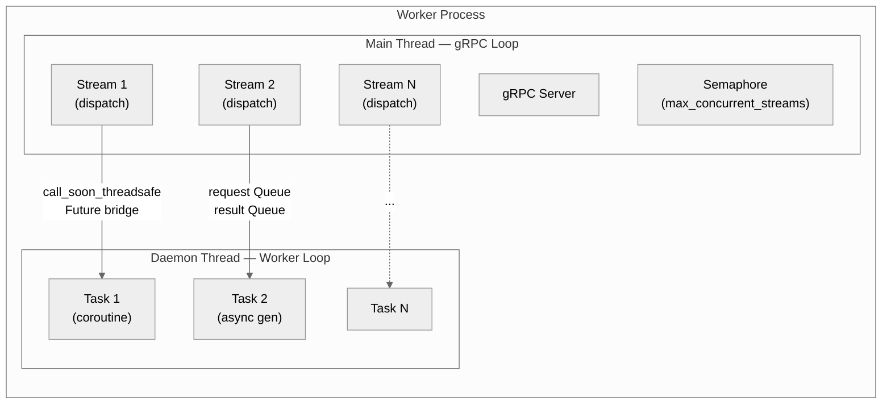
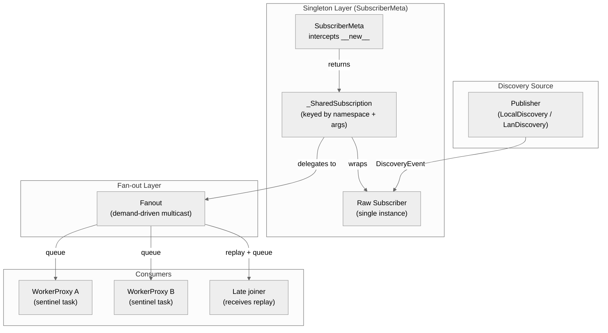
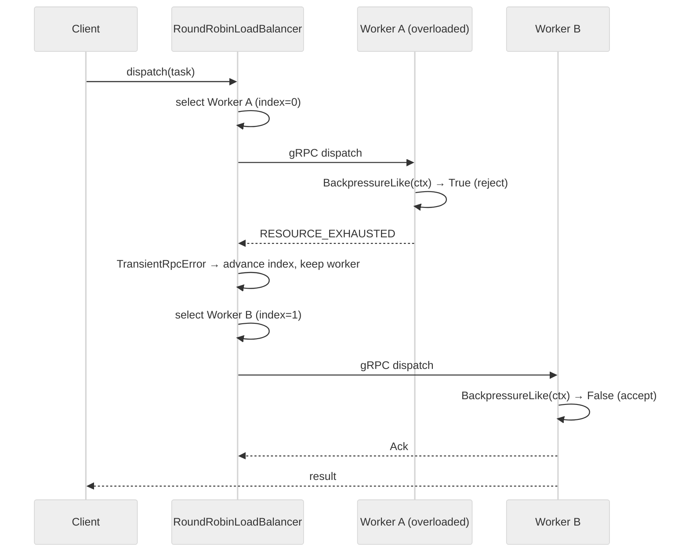

# Wool: A Lightweight Distributed Execution Runtime for Python

**Conrad Bzura, April 2025**

This document is a technical reference for the Wool distributed Python runtime. It is intended as a handbook for Wool users with low-level system questions, engineers evaluating Wool as a backend for distributed Python applications, and contributors to the Wool core. It is not an introduction to Wool; for that, refer to the [Getting Started tutorials](01-hello-world-ml.md) and the [Wool GitHub repository](https://github.com/wool-labs/wool).

## Abstract

This paper presents Wool, a distributed Python runtime that extends Python's native async execution model to operate transparently across process boundaries. Wool is designed as a composable execution primitive rather than an application framework; it imposes no workflow model, no orchestration engine, and no state management layer. Instead, it provides a minimal set of structural protocols—for task dispatch, worker discovery, and load balancing—that integrate with Python's existing async semantics, including coroutines, async generators, exception propagation, and context variables. The design prioritizes efficiency, composibility, and simplicity, with the goal that distribution is expressed entirely through source-level annotations rather than external configuration, broker infrastructure, or deployment manifests. This paper describes the architecture, protocols, and implementation of Wool, with particular attention to the tradeoffs that follow from its positioning as a focused execution layer.

## Contents

- [1. Introduction](#1-introduction)
  - [1.1 Motivation](#11-motivation)
  - [1.2 Design Goals](#12-design-goals)
  - [1.3 System Scope](#13-system-scope)
- [2. Related Systems](#2-related-systems)
- [3. Architecture Overview](#3-architecture-overview)
  - [3.1 Application Concepts](#31-application-concepts)
  - [3.2 Components](#32-components)
  - [3.3 ResourcePool](#33-resourcepool)
- [4. Wire Protocol](#4-wire-protocol)
  - [4.1 Service Definition](#41-service-definition)
  - [4.2 Message Schema](#42-message-schema)
  - [4.3 Dispatch Sequence](#43-dispatch-sequence)
  - [4.4 Serialization](#44-serialization)
  - [4.5 Protocol Version Compatibility](#45-protocol-version-compatibility)
- [5. Execution Model](#5-execution-model)
  - [5.1 Task Lifecycle](#51-task-lifecycle)
  - [5.2 Async Generator Streaming](#52-async-generator-streaming)
  - [5.3 Worker Thread Model](#53-worker-thread-model)
  - [5.4 Self-Dispatch Optimization](#54-self-dispatch-optimization)
  - [5.5 Exception Propagation](#55-exception-propagation)
  - [5.6 Error Classification](#56-error-classification)
  - [5.7 Context Propagation](#57-context-propagation)
- [6. Worker Discovery](#6-worker-discovery)
  - [6.1 Protocol Design](#61-protocol-design)
  - [6.2 LocalDiscovery](#62-localdiscovery)
  - [6.3 LanDiscovery](#63-landiscovery)
  - [6.4 Self-Describing Workers](#64-self-describing-workers)
  - [6.5 Filtered Discovery](#65-filtered-discovery)
- [7. Load Balancing](#7-load-balancing)
  - [7.1 Protocol](#71-protocol)
  - [7.2 Default Implementation](#72-default-implementation)
  - [7.3 Backpressure Integration](#73-backpressure-integration)
  - [7.4 Extension Points](#74-extension-points)
- [8. Worker Pool Composition](#8-worker-pool-composition)
  - [8.1 Pool Modes](#81-pool-modes)
  - [8.2 Tags and Filtering](#82-tags-and-filtering)
  - [8.3 Lease-Based Capacity Control](#83-lease-based-capacity-control)
  - [8.4 Nested Pool Propagation](#84-nested-pool-propagation)
  - [8.5 Admission Filters](#85-admission-filters)
- [9. Transport Security](#9-transport-security)
  - [9.1 Transport Modes](#91-transport-modes)
  - [9.2 Credential Management](#92-credential-management)
  - [9.3 Credential Propagation](#93-credential-propagation)
- [10. Resource Pooling](#10-resource-pooling)
  - [10.1 gRPC Channel Pooling](#101-grpc-channel-pooling)
  - [10.2 Discovery Subscriber Pooling](#102-discovery-subscriber-pooling)
  - [10.3 Worker Proxy Pooling](#103-worker-proxy-pooling)
- [11. Design Decisions and Tradeoffs](#11-design-decisions-and-tradeoffs)
- [12. Conclusion](#12-conclusion)

## 1. Introduction

### 1.1 Motivation

The Python ecosystem offers several mature frameworks for distributed execution, including Celery, Ray, Prefect, Dask, and Dramatiq. These systems address legitimate and well-understood problems, and their widespread adoption is evidence of their value. They share, however, a common architectural pattern: distributed execution is coupled with orchestration, state management, retry logic, and task scheduling. A developer seeking to execute a function on a remote process must generally adopt a programming model—task registries, DAGs, serialization constraints, message broker configuration—that imposes structure well beyond the execution concern itself.

This coupling is not inherently wrong, but it does create a barrier for use cases that do not require full orchestration. Many distributed workloads require only the ability to execute a function on another process and retrieve its result, without persistent state, retry policies, or centralized scheduling.

Wool is an attempt to provide that capability as a standalone primitive. It takes the position that Python's existing async semantics are sufficient to express distributed workflows when augmented with transparent inter-process dispatch. Wool adds the dispatch layer and leaves everything else to the developer, who is assumed to understand their workload and infrastructure better than a general-purpose framework can.

### 1.2 Design Goals

The core principles that drive Wool's architecture are API simplicity and composability — where composability means that every extension point (discovery, load balancing, worker implementation, serialization) is a structural protocol that can be replaced independently without coupling to Wool's internal class hierarchy — while the core system goals are low dispatch overhead and horizontal scalability through decentralized coordination. We are willing to sacrifice certain desirable properties—such as at-least-once delivery, distributed state management, and centralized scheduling—in order to preserve these core goals. The rationale is that such properties are application-level concerns whose ideal implementation depends on the specific workload, and embedding them in the execution layer would constrain the kinds of workflows that Wool can support.

A Wool programmer expresses their logic with standard Python async primitives while the runtime manages physical execution placement. A distributed program and its single-process equivalent differ by a decorator (`@wool.routine`) and a context manager (`WorkerPool`). Removing these annotations from a distributed program produces a working local program; adding them to a local program makes it distributed. This symmetry is the central design goal.

### 1.3 System Scope

Wool seeks to enable the transparent distribution of Python async functions and async generators across pools of worker processes. It provides worker lifecycle management, pluggable service discovery, client-side load balancing, and bidirectional streaming over gRPC. It does not provide a distributed object store, a centralized scheduler, a workflow engine, retry policies, task persistence, or an actor model. These are explicitly out of scope and are expected to be composed externally by users who need them.

## 2. Related Systems

Distributed systems for Python span a broad design space, and Wool occupies a deliberately narrow region within it; understanding where it sits relative to existing tools clarifies both its intent and its limitations.

Task queue systems such as Celery, Dramatiq, and Huey couple the act of remote execution with a substantial middleware surface: message brokers, result backends, task registries, serialization schemes, and retry policies are, in most configurations, required before a single task can be dispatched. Wool provides none of these facilities, offering instead only the execution primitive itself—an async function or async generator, decorated and dispatched over gRPC with no broker intermediary. Where task queues generally assume that work is enqueued for eventual processing by a consumer, Wool assumes that a caller invokes a routine and receives its result, or a stream of results, in the manner of an ordinary function call. The consequence is that concerns such as persistence, retry, and dead-letter handling must be composed externally rather than configured within the framework.

Distributed computing frameworks, notably Ray and Dask, are comprehensive platforms that provide their own object stores, schedulers, and programming models. Ray, for instance, treats actors, objects, and tasks as first-class concepts, with distributed memory management and reference counting across a cluster; Dask constructs task graphs and coordinates them through a centralized scheduler. Wool is considerably narrower in scope—it merely provides transparent dispatch of async callables over gRPC. We believe this tradeoff is justified for workloads where simplicity and composability matter more than the integrated resource management that Ray and Dask offer. Wool does not preclude stateful or data-locality-aware patterns—worker-scoped state, sticky routing, and custom discovery predicates can approximate some of these capabilities—but it does not provide them as first-class abstractions in the way that Ray and Dask do.

Python's built-in parallelization mechanisms, including the `multiprocessing` module and `concurrent.futures`, provide process-level parallelism but lack network transparency, offer no support for streaming results, and do not extend async generator semantics across process boundaries. Wool can be understood as extending these capabilities with gRPC-based transport, bidirectional streaming via async generators, and pluggable service discovery, while retaining the call-site-transparent RPC semantics that `concurrent.futures` established.

Actor frameworks such as Erlang/OTP, Akka, and Pykka organize computation around stateful, long-lived actors that communicate through message passing, and they generally provide supervision trees, fault isolation, and location-transparent addressing as core abstractions. Wool does not impose an actor model in its core; it operates on plain async functions and generators, and workers are general-purpose execution environments rather than actors with encapsulated state. In other words, Wool treats the unit of distribution as a function invocation, not as a persistent entity. It is worth noting, however, that Wool routines can modify a worker's global state between invocations, and the combination of worker-scoped state, sticky load balancing, and supervision logic composed at the application level could be used to implement actor-like patterns on top of Wool's execution primitives. We expect to formalize support for these patterns in future work, but they would remain optional add-ons rather than core runtime concerns.

Workflow engines—Airflow, Prefect, and Temporal among them—manage graph-based workflows with persistence, scheduling, monitoring, and, in the case of Temporal, durable execution guarantees. Wool does not manage workflows; it provides the execution mechanism that a workflow engine might use internally to dispatch individual steps across a pool of workers. The relationship is complementary rather than competitive: a workflow engine defines *what* runs and *when*, while Wool defines *where* and *how* a callable is executed.  

## 3. Architecture Overview

### 3.1 Application Concepts

A Wool application is expressed in terms of five user-facing concepts: routines, tasks, discovery namespaces, worker pools, and workers.

A **Wool routine** is an async function or async generator decorated with `@wool.routine`. The decorator does not alter the function's signature or return type; it augments the function so that, when called within an active worker pool context, the invocation is dispatched to a remote worker process rather than executed locally. When no pool context is active, the decorated function behaves identically to its undecorated form. In other words, a Wool routine is a standard Python async callable that is optionally distributable depending on the execution context.

A **task** is a single invocation of a Wool routine that has been dispatched for remote execution. Each task is represented internally by a `Task` dataclass that captures the callable, its positional and keyword arguments, a unique identifier, a reference to the originating `WorkerProxy`, and a snapshot of the caller's `RuntimeContext`. Tasks are executed asynchronously with respect to the caller: for coroutine routines, the caller `await`s a single return value; for async generator routines, the caller iterates a stream of yielded values using `anext()`, `asend()`, `athrow()`, and `aclose()`, with each operation producing one round-trip over the network. Tasks can be nested — a routine executing on a worker can dispatch further routines to the same or a different pool — and the parent-child relationship is tracked via a `caller` field on the `Task` dataclass.

A **discovery namespace** is a string identifier that scopes a set of workers for the purpose of mutual discovery. Workers published under a given namespace are visible to any proxy that subscribes to that namespace, regardless of whether the subscribing process is the one that spawned the workers. Namespaces are the mechanism by which independent processes share worker pools: two processes that create pools with the same `LocalDiscovery("my-namespace")` argument will see each other's workers.

A **worker pool** is an async context manager (`WorkerPool`) that defines the scope within which Wool routines are distributed. On entry, the pool optionally spawns worker subprocesses, publishes their metadata to a discovery service, and creates a `WorkerProxy` that subscribes to the discovery stream. On exit, it reverses the process. A pool may be ephemeral (spawning and managing its own workers), durable (connecting to externally managed workers via discovery), or hybrid (both). The pool itself does not participate in task dispatch; it establishes the infrastructure through which dispatch occurs.

A **worker** is a subprocess that hosts a gRPC server and executes dispatched tasks. Each worker advertises a `WorkerMetadata` dataclass containing its unique identifier, network address, process ID, protocol version, capability tags, arbitrary key-value metadata, a security flag, and a `ChannelOptions` structure describing its gRPC transport configuration. This metadata is published to the discovery service and used by proxies to establish correctly configured connections. Workers are general-purpose execution environments: they execute whatever callable is dispatched to them and, while they can maintain global state between invocations, the core runtime does not impose any state management discipline.

### 3.2 Components

Wool's runtime is composed of six components: the routine decorator, the worker pool, the worker proxy, a discovery service, a load balancer, and one or more workers. The first three are fixed parts of the runtime, whereas the discovery service, load balancer, and worker are each defined by a structural protocol (`DiscoveryLike`, `LoadBalancerLike`, and `WorkerLike` respectively) that can be replaced independently to suit the requirements of a given deployment.

The entry point for distribution is the `@wool.routine` decorator, which is applied to async functions and async generators. When a decorated function is called within an active `WorkerPool` context, the decorator constructs a `Task` object (a serializable envelope containing the callable, its arguments, and a reference to the current `WorkerProxy`) and passes it to the proxy for dispatch rather than executing it locally. Outside a pool context, the decorated function executes as an ordinary coroutine or async generator. In other words, the same function is distributable or local depending solely on whether a pool is active at the call site. The dispatch decision is governed internally by a context variable, `_do_dispatch`, which is toggled during worker-side execution to prevent infinite recursion: when a task runs on a worker, direct calls to the immediate callable execute locally, but any nested `@wool.routine` calls within its body are still dispatched outward to the pool (see `src/wool/runtime/routine/wrapper.py`).

The `WorkerPool` async context manager is responsible for orchestrating the lifecycle of a pool. On entry, it resolves its operational mode from the `spawn` and `discovery` parameters, optionally spawns ephemeral worker subprocesses, publishes their metadata to the discovery service, and creates a `WorkerProxy` configured with the specified discovery subscriber and load balancer. On exit, it reverses the process: ephemeral workers are unpublished and stopped, and the discovery service is closed. We believe this design keeps the pool's responsibilities narrow — it manages lifecycle and wiring, but does not participate in task dispatch, which is handled entirely by the proxy (see `src/wool/runtime/worker/pool.py`).

The `WorkerProxy` is the component that connects application code to the set of available workers. It subscribes to a discovery event stream and runs a sentinel task, which is a background async loop that consumes `worker-added`, `worker-updated`, and `worker-dropped` events and uses them to maintain a `LoadBalancerContext` — a mutable mapping of live workers to their gRPC connections. When a routine is dispatched, the proxy delegates to the load balancer, which selects a worker from this context. The proxy is lazily initialized by default, meaning it defers discovery subscription and sentinel startup until the first `dispatch()` call, which avoids unnecessary overhead for nested routines that may never execute nested calls. The proxy is also picklable: its `__reduce__` method serializes the discovery configuration, load balancer type, lease limit, and proxy identifier, and this serialization is the mechanism by which nested Wool routine calls on remote workers are able to locate and reconnect to their originating pool (see `src/wool/runtime/worker/proxy.py`).

Discovery is the mechanism by which workers advertise their availability and proxies learn about them. The `DiscoveryLike` structural protocol composes a publisher (a single `publish` method for broadcasting lifecycle events) and a subscriber (an `__aiter__` interface yielding `DiscoveryEvent` objects), with an optional `subscribe(filter=)` method for predicate-based filtered views. Wool ships two implementations: `LocalDiscovery`, which uses shared memory and filesystem notifications for single-machine pools, and `LanDiscovery`, which uses mDNS via Zeroconf for network-wide discovery. Both are scoped by a namespace string, so multiple independent pools can coexist on the same machine or network. Because `DiscoveryLike` is a structural protocol, a deployment that already uses a service registry such as Consul or etcd can implement a compatible backend without inheriting from any Wool base class — conforming to the method signatures is sufficient (see `src/wool/runtime/discovery/`).

The load balancer determines which worker receives a given task. The `LoadBalancerLike` structural protocol requires a single async method, `dispatch(task, *, context, timeout)`, which returns an `AsyncGenerator` that streams results back to the caller. The `context` parameter is a `LoadBalancerContext` managed by the proxy's sentinel task, and because this context is passed in rather than owned by the balancer, a single balancer instance can service multiple independent pools without conflating their state. Wool ships a `RoundRobinLoadBalancer` as the default. For deployments where round-robin is insufficient — for example, when tasks have highly variable cost — a custom balancer that tracks in-flight counts or manages worker scaling can be substituted by conforming to the same single-method protocol (see `src/wool/runtime/loadbalancer/`).

Workers are the processes that actually execute dispatched tasks. The `WorkerLike` structural protocol requires `start`, `stop`, `metadata`, `address`, `uid`, `tags`, and `extra` members, and Wool's default implementation, `LocalWorker`, spawns a subprocess containing a gRPC server, a `WorkerService` that deserializes and executes tasks, and a dedicated worker event loop on a background thread that isolates CPU-bound task execution from gRPC I/O. Each worker advertises its capabilities and transport configuration through a `WorkerMetadata` dataclass (including its address, capability tags, and gRPC channel options), which is published to the discovery service and used by the proxy to configure gRPC connections automatically. In other words, workers are self-describing: a client that discovers a worker can connect to it with the correct message size limits, keepalive intervals, and compression settings without any out-of-band configuration (see `src/wool/runtime/worker/local.py`, `src/wool/runtime/worker/process.py`, `src/wool/runtime/worker/service.py`).

The following diagram illustrates how these six components interact across the four phases of a pool's lifetime.



*Figure 1. Pool lifecycle and task dispatch. The client creates a worker pool, which spawns workers, publishes them to the discovery service, and creates a WorkerProxy. The proxy's sentinel task consumes discovery events and maintains a live view of available workers in the load balancer context. On dispatch, the routine layer constructs a task and passes it to the proxy, which delegates to the load balancer for worker selection. Results stream back over a bidirectional gRPC connection through the proxy. Teardown reverses the startup sequence.*

The following diagram shows the static dependency relationships between Wool's architectural layers. Arrows indicate "depends on" relationships; layers at the bottom of the graph have no upward dependencies. The Worker Runtime, Routine & Task, and Discovery layers form the core of the system, each depending on the Shared Utilities layer for cross-cutting async primitives. The Wire Protocol layer sits at the foundation as the serialization substrate.



*Figure 2. Static layer dependencies. Each arrow represents an import dependency between architectural layers. The Worker Runtime is the most connected layer, depending on all others. Discovery and Routine & Task are peers that share the Shared Utilities layer but do not depend on each other. The Wire Protocol has no upward dependencies.*

### 3.3 ResourcePool

A distributed runtime that opens gRPC channels, spawns discovery subscribers, and maintains worker proxies across many concurrent tasks faces a classic tension: creating these objects is expensive, yet holding them indefinitely wastes memory and file descriptors. Wool resolves this through a single generic abstraction — `ResourcePool` — which is instantiated with different factory and finalizer callables to manage each resource category. `ResourcePool` is not part of Wool's public API — it is an internal abstraction that users never interact with directly. We introduce it here because it is used throughout the runtime (by the discovery, connection, proxy, and service layers), and understanding its semantics is necessary to follow the resource lifecycle discussions in later sections.

`ResourcePool[T]` is a fully asynchronous, reference-counted cache with configurable time-to-live cleanup. A pool is parameterised at construction with a `factory` callable that creates new objects on demand, an optional `finalizer` that tears them down, and a `ttl` that controls how long an unreferenced object may linger before the finalizer runs. Both the factory and the finalizer may be synchronous or asynchronous — `ResourcePool` detects coroutines and awaits them transparently.

Internally, each cached object is wrapped in a `CacheEntry` that tracks the current `reference_count` and an optional `cleanup` task. When `acquire(key)` is called and the key already exists, the pool increments the reference count and cancels any pending TTL cleanup. When `release(key)` decrements the count to zero and a TTL is configured, an `asyncio.Task` is scheduled that sleeps for the TTL duration and then, under the lock, verifies that the count is still zero before invoking the finalizer. This deferred-cleanup strategy means that bursty workloads — which release and immediately re-acquire the same resource — avoid the overhead of repeated teardown and reconstruction.

One subtlety is cross-loop safety. Because Wool runs worker logic on a dedicated event loop in a background thread (see Section 5.3), a cleanup task may have been created on a different loop from the one that later attempts to cancel it. `ResourcePool` handles this by inspecting the task's owning loop via `get_loop()` and, when the loops differ, calling `cancel()` through `call_soon_threadsafe` rather than awaiting the task directly. (Code reference: `src/wool/runtime/resourcepool.py`.)

The following table summarises the four `ResourcePool` instantiations across the codebase, each of which is described in detail in Section 10.

| Pool | Type Parameter | Cache Key | Factory | Finalizer | TTL | Location |
|---|---|---|---|---|---|---|
| gRPC channels | `_Channel` | `(target, credentials, options)` | Create `grpc.aio.Channel` + `WorkerStub` + `Semaphore` | Close channel | 60s | `connection.py` (module-level) |
| Discovery subscribers | `_SharedSubscription` | Constructor args (namespace, poll_interval, ...) | Create raw subscriber | Close subscriber | None | `pool.py` (via `ContextVar`) |
| Worker proxies | `WorkerProxy` | Proxy instance | `proxy.enter()` | `proxy.exit()` | 60s | `process.py` (via `__proxy_pool__` `ContextVar`) |
| Worker event loops | `(EventLoop, Thread)` | `"worker-loop"` | `new_event_loop()` + `Thread(run_forever)` | `call_soon_threadsafe(stop)` + `join` + `close` | None | `service.py` |

## 4. Wire Protocol

### 4.1 Service Definition

The `Worker` gRPC service exposes exactly two RPCs: a bidirectional streaming `dispatch` and a unary `stop`.

```protobuf
service Worker {
    rpc dispatch (stream Request) returns (stream Response);
    rpc stop (StopRequest) returns (Void);
}
```

The choice of a single bidirectional stream for `dispatch` — rather than separate unary and server-streaming RPCs — is deliberate, since a Wool routine may be either an ordinary coroutine that returns one value or an async generator that yields many values, and the caller cannot always know which case applies at invocation time. A unified streaming RPC accommodates both patterns without negotiation. The `stop` RPC is kept unary because graceful shutdown is a one-shot command; it accepts a `StopRequest` carrying a float timeout and returns a `Void` sentinel once the worker has drained or cancelled in-flight work. (Code reference: `proto/wire.proto`.)

### 4.2 Message Schema

The `Task` message constitutes the initial payload of every dispatch and carries the full execution context. Its first four fields — `version`, `id`, `caller`, and `tag` — form the lightweight "envelope" that can be parsed independently via the `TaskEnvelope` message. `TaskEnvelope` is a separate protobuf message definition that declares only these four fields using the same field numbers as `Task`. Because Protocol Buffers ignores unknown fields during deserialization, parsing a full `Task` byte stream as a `TaskEnvelope` silently skips the heavy cloudpickle payload fields (callable, args, kwargs) and returns only the metadata. This is the mechanism that makes the `VersionInterceptor` (Section 4.5) efficient: it can extract the client's protocol version from the raw bytes of every incoming dispatch without deserializing any of the executable payload. The remaining fields encode the executable material: `callable`, `args`, and `kwargs` hold the pickled function and its arguments; `proxy` and `proxy_id` identify the worker proxy through which the task was dispatched; `timeout` governs per-task deadlines; and the optional `context` carries a `RuntimeContext` snapshot so that caller-side settings such as `dispatch_timeout` are propagated to the worker. An optional `serializer` field, when present, holds a pickled `Serializer` instance that the receiving side restores via an LRU-cached `_unpickle_serializer` to decode the payload fields.

The `Request` message wraps a `oneof payload` whose four alternatives correspond to the stages of the async iteration protocol: `task` initiates execution, `next` advances a remote generator, `send` pushes a value into the generator, and `throw` injects an exception. The `Response` mirror offers `ack` (task accepted), `nack` (task rejected, with a human-readable `reason`), `result` (a yielded or returned value), and `exception` (a remotely raised error). Both `result` and `exception` carry a `Message` whose single `bytes dump` field contains a cloudpickle-serialized Python object.

### 4.3 Dispatch Sequence

A dispatch begins when `WorkerConnection.dispatch` serializes a `Task` via `to_protobuf`, wraps it in a `Request`, and writes it to the bidirectional stream. On the server side, `WorkerService.dispatch` reads this first `Request`, reconstitutes the `Task` with `Task.from_protobuf`, evaluates any backpressure hook, and — if the task is admitted — responds with an `Ack` containing the worker's protocol version. The client verifies the `Ack`; a `Nack` or any other response type raises `RpcError` or `UnexpectedResponse`, respectively.

For a coroutine, the worker schedules execution on a dedicated worker event loop via `_run_on_worker`, awaits the result, and writes a single `Response(result=...)` before the stream closes. For an async generator, the server enters `_stream_from_worker`, which bridges the gRPC event loop and the worker event loop through a pair of `asyncio.Queue` instances: client `next`/`send`/`throw` requests arrive on the gRPC loop, are forwarded to the worker loop's request queue, and generator yields travel back via the result queue. Stream termination occurs when the generator is exhausted, when `aclose` cancels the gRPC call, or when the connection encounters a transport-level error. (Code references: `src/wool/runtime/worker/connection.py`, `src/wool/runtime/worker/service.py`.)

### 4.4 Serialization

Wool employs a two-layer serialization strategy. The outer envelope — protobuf — handles structure and framing: field tags, lengths, and the `oneof` discriminator are all encoded in Protocol Buffers' native binary format, which ensures cross-version parsability even when the inner payloads are opaque. The inner payloads — the `callable`, `args`, `kwargs`, and `proxy` fields of `Task`, as well as every `Message.dump` — default to cloudpickle, which can serialize closures, lambdas, and objects defined interactively. The `Serializer` protocol abstracts this inner layer behind a `dumps`/`loads` interface. When a `Serializer` is supplied to `to_protobuf`, it replaces cloudpickle for the `callable`, `args`, and `kwargs` fields (`proxy` is always serialized with cloudpickle regardless) and its own pickled form is written into the `serializer` field so that the receiving side can restore it. (Code reference: `src/wool/runtime/routine/task.py`.)

### 4.5 Protocol Version Compatibility

Wool guards against protocol-level incompatibilities through the `VersionInterceptor`, a server-side gRPC interceptor that inspects the first message of every `dispatch` stream to extract the client's protocol version before any task deserialization occurs. It accomplishes this through a lightweight parse of the `TaskEnvelope` protobuf message — the partial projection described in Section 4.2 — that exposes only the first four fields of the `Task` wire format (version, ID, caller, tag) without touching the potentially large cloudpickle payload bytes. The extracted client version is evaluated against the local worker version: a client is accepted if and only if its major version matches the server's and its full version is less than or equal to the server's. Requests with empty, missing, or unparseable version strings are rejected with a `Nack` response. (Code reference: `src/wool/runtime/worker/interceptor.py`.)

## 5. Execution Model

### 5.1 Task Lifecycle

A task in Wool traverses several well-defined stages from invocation to result delivery: construction, serialization, transport, acknowledgment, deserialization, execution, and result return.

**Construction.** When a caller invokes a `@wool.routine`-decorated function, the wrapper first consults the `_do_dispatch` context variable to determine whether remote dispatch is active. If it is, the wrapper retrieves the current `WorkerProxy` from the process-wide context variable `wool.__proxy__`, constructs a `Task` dataclass, and passes it to `proxy.dispatch()`. The `Task` captures the callable, its positional and keyword arguments, a unique UUID, a human-readable tag (module, qualified name, and source line number), and a reference to the proxy. During `__post_init__`, the `Task` also records a `caller` identifier if a parent task is active (enabling nested-task tracking) and snapshots the current `RuntimeContext`, which at present carries the dispatch timeout setting. (Code references: `src/wool/runtime/routine/wrapper.py`, `src/wool/runtime/routine/task.py`.)

**Serialization and transport.** The proxy delegates to the load balancer, which selects a target worker from its pool and invokes `WorkerConnection.dispatch()`. The connection acquires a pooled gRPC channel keyed by the tuple `(target, credentials, channel_options)` and obtains a concurrency semaphore slot sized by `max_concurrent_streams`. The `Task` is serialized to protobuf via `to_protobuf()`: the callable, args, and kwargs are each individually pickled with `cloudpickle`, while the proxy reference is always cloudpickled regardless of serializer. The serialized protobuf is wrapped in a `Request` message and written to a bidirectional gRPC stream. (Code reference: `src/wool/runtime/worker/connection.py`.)

**Acknowledgment.** Upon receiving the first `Request`, the worker-side `WorkerService.dispatch()` deserializes the `Task` from protobuf, optionally evaluates a backpressure hook, and responds with an `Ack` to signal acceptance. If the worker is shutting down, it aborts with `UNAVAILABLE`; if backpressure rejects the task, it aborts with `RESOURCE_EXHAUSTED`. On the client side, the connection validates the `Ack` and, if it receives a `Nack` or an unexpected payload, raises an `RpcError` or `UnexpectedResponse`. Transient gRPC errors (`UNAVAILABLE`, `DEADLINE_EXCEEDED`, `RESOURCE_EXHAUSTED`) are wrapped as `TransientRpcError` so the load balancer can retry on a different worker. (Code references: `src/wool/runtime/worker/service.py`, `src/wool/runtime/worker/connection.py`.)

**Execution and result return.** For coroutine tasks, the worker schedules execution on the worker event loop (see Section 5.3), awaits the result, serializes it with `cloudpickle`, and sends it as a single `Message` response. For async generator tasks, execution follows a streaming protocol described in Section 5.2. In both cases, the `Task` enters its own context manager during execution: it sets itself as the `_current_task` context variable (so nested tasks can record their caller), restores the captured `RuntimeContext`, and sets `do_dispatch(False)` to prevent re-dispatch of the immediate callable while still allowing nested `@wool.routine` calls within its body to dispatch normally. (Code reference: `src/wool/runtime/routine/task.py`.)

### 5.2 Async Generator Streaming

Wool supports distributing async generator functions with the same decorator used for coroutines. The challenge is that Python's async generator protocol is inherently interactive — the consumer drives iteration one step at a time with `anext()`, `asend()`, and `athrow()` — and this interactivity must be preserved across process boundaries. Wool solves this with a pull-based, bidirectional gRPC stream in which every client request produces exactly one server response.

After the initial `Ack`, the client-side `_DispatchStream` sends a `next` request to advance the remote generator. The worker reads the request from a cross-thread queue, calls `asend(None)` on the generator (on the worker event loop), and writes the yielded value back as a `Message` response. `asend(value)` follows the same pattern: the client serializes the value with `cloudpickle`, sends it as a `send` request, and the worker calls `asend(value)` on the generator. `athrow(exc)` serializes the exception, sends it as a `throw` request, and the worker calls `athrow(type(exc), exc)` on the generator. In each case, the worker produces exactly one response per request — either a yielded value, a serialized exception, or a `StopAsyncIteration` sentinel — so neither side buffers. (Code references: `src/wool/runtime/worker/connection.py`, `src/wool/runtime/worker/service.py`.)

Stream cancellation is initiated by calling `aclose()` on the client-side wrapper, which cancels the underlying gRPC call. On the worker side, the cancelled stream causes the request iterator to terminate; a `finally` block in the worker dispatch coroutine then calls `aclose()` on the actual generator, ensuring that cleanup code (e.g., `finally` blocks within the generator body) runs even on remote cancellation. The decorator's own wrapper in `wrapper.py` catches `GeneratorExit` and delegates to `aclose()`, so breaking out of an `async for` loop behaves identically to doing so with a local generator. (Code reference: `src/wool/runtime/routine/wrapper.py`.)

### 5.3 Worker Thread Model

Wool employs a dual-loop architecture within each worker process to isolate I/O-bound gRPC operations from potentially CPU-intensive task execution. The gRPC server runs on the process's main asyncio event loop, where it handles incoming requests, sends responses, manages health checks, and runs the discovery sentinel. Task execution, by contrast, runs on a dedicated worker event loop hosted on a separate daemon thread, created on demand via a `ResourcePool` (see Section 3.3) with `asyncio.new_event_loop()` and `threading.Thread(target=loop.run_forever)`.

For coroutine tasks, `_run_on_worker()` copies the current `contextvars` context, schedules the task on the worker loop with `call_soon_threadsafe`, and bridges the result back to the gRPC loop via a `concurrent.futures.Future` wrapped with `asyncio.wrap_future()`. For async generators, `_stream_from_worker()` uses a pair of cross-thread `asyncio.Queue` instances: the gRPC loop reads client requests and forwards `(action, payload)` tuples to the worker loop's request queue via `call_soon_threadsafe`, and the worker loop writes `(tag, value)` tuples back to the result queue for the gRPC loop to yield. This design means that a CPU-bound generator step blocks only the worker loop; the gRPC loop remains responsive to new dispatches, health checks, and cancellation signals throughout. (Code reference: `src/wool/runtime/worker/service.py`.)



*Figure 3. Dual-loop worker architecture. The gRPC server handles N concurrent dispatch streams on the main thread, gated by a per-channel semaphore. Each stream bridges to the worker event loop on a daemon thread: coroutine tasks use a Future bridge, while async generators use a pair of cross-thread queues. CPU-bound work on the worker loop does not block gRPC I/O.*

### 5.4 Self-Dispatch Optimization

When a worker executes a task that dispatches a nested routine back to the same worker (i.e., the connection target matches the worker's own address), the full `cloudpickle` serialization of the callable, arguments, and kwargs is unnecessary because sender and receiver share the same process. In this case, `WorkerConnection.dispatch()` substitutes a `PassthroughSerializer` for the default cloudpickle path. Rather than pickling each object, `dumps()` stores it in a module-level `WeakKeyDictionary` under a freshly minted `_PassthroughKey` (a weak-referenceable wrapper around a UUID) and returns only the 16-byte UUID token. The receiving side calls `loads()`, which reconstructs the key from the token bytes and pops the object from the store. The gRPC stream is still used so that the full bidirectional streaming protocol — acknowledgment, result messages, cancellation — remains in force; only the serialization cost is eliminated. All `PassthroughSerializer` instances hash and compare equal, which ensures that the LRU-cached `_pickle_serializer` function (used to serialize the serializer itself into the protobuf) hits on every self-dispatch call rather than creating redundant cache entries. A further optimisation targets the transport layer: when self-dispatch is detected, `WorkerConnection` checks for a Unix domain socket address that the worker process published at startup (via `wool.__worker_uds_address__`) and, if present, substitutes it for the TCP target, eliminating TCP overhead entirely. The UDS address is set by `WorkerProcess._serve()` during process initialisation and is not constructed by the connection layer itself. (Code references: `src/wool/runtime/routine/task.py`, `src/wool/runtime/worker/connection.py`.)

### 5.5 Exception Propagation

When an exception is raised during task execution on a worker, the worker serializes the exception with `cloudpickle` — which, in conjunction with `tblib`, preserves the full traceback chain — and sends it as an `exception` response payload. On the client side, `_DispatchStream._read_next()` deserializes the exception and re-raises it directly. For coroutine tasks, this exception surfaces from the `await` call; for async generator tasks, it surfaces from the corresponding `anext()`, `asend()`, or `athrow()` call. The effect is that remote exceptions appear with their original type and traceback as though they were raised locally, which we believe simplifies debugging considerably in systems where tasks are distributed across many workers. The `Task` context manager additionally captures a `TaskException` dataclass (containing the exception's qualified type name and formatted traceback lines) for structured logging on the worker side before allowing the exception to propagate. (Code references: `src/wool/runtime/worker/connection.py`, `src/wool/runtime/routine/task.py`.)

### 5.6 Error Classification

Wool categorises errors into distinct types that determine how the load balancer and caller respond. The following table summarises every error type, where it originates, and how it is handled.

| Error Type | Defined In | Origin | Handling |
|---|---|---|---|
| `TransientRpcError` | `connection.py` | gRPC `UNAVAILABLE`, `DEADLINE_EXCEEDED`, or `RESOURCE_EXHAUSTED` | Load balancer advances to next worker; failed worker remains in context |
| `RpcError` | `connection.py` | `Nack` response from worker, or non-transient gRPC failure | Load balancer removes worker from context, continues to next |
| `UnexpectedResponse` | `connection.py` | Response payload does not match expected type (e.g., result where ack expected) | Raised to caller immediately |
| `NoWorkersAvailable` | `loadbalancer/base.py` | All workers in context exhausted without successful dispatch | Raised to caller; no retry |
| `TaskException` | `routine/task.py` | Structured capture of remote exception (type name + traceback lines) | Logged on worker side before propagation |
| Remote exception (any type) | `connection.py` | Exception raised during task execution on worker, serialized via cloudpickle+tblib | Deserialized and re-raised at the caller's `await` or `anext()` with original type and traceback |

The key design choice is the two-tier split between transient and non-transient errors: transient errors (which include backpressure rejection) leave the pool topology intact and trigger a retry on the next worker, while non-transient errors actively shrink the pool by removing the faulted worker. This means that temporary conditions like server overload are self-healing, while persistent faults like protocol incompatibility are self-pruning.

### 5.7 Context Propagation

Wool captures a `RuntimeContext` snapshot at task creation time (in `Task.__post_init__`) and propagates it to the worker via a protobuf `RuntimeContext` message embedded in the `Task` payload. On the worker side, `Task._run()` and `Task._stream()` restore this context before executing the callable by entering the `RuntimeContext` as a context manager, which sets the relevant `ContextVar` values for the duration of execution. Currently, the only propagated setting is `dispatch_timeout`, which controls the timeout applied to nested dispatch calls within the task body. The mechanism is, however, straightforwardly extensible: adding a new propagated setting requires only a new `ContextVar`, corresponding fields on `RuntimeContext`, and `to_protobuf`/`from_protobuf` handling. In other words, the wire format already supports arbitrary key-value context; the Python-side plumbing is the only addition needed for each new setting. (Code reference: `src/wool/runtime/context.py`.)

## 6. Worker Discovery

### 6.1 Protocol Design

Wool defines three structural protocols for discovery in `base.py`: `DiscoveryPublisherLike`, `DiscoverySubscriberLike`, and `DiscoveryLike`. All three are decorated with `@runtime_checkable`, which means that any object satisfying the required method signatures is considered a valid implementation without inheriting from a shared base class; in other words, structural (duck-typed) conformance is sufficient and nominal inheritance is never required. This design decision is deliberate: it allows third-party code to supply alternative discovery backends — backed by Consul, etcd, or a cloud-native service mesh, for instance — without importing or depending on Wool's own class hierarchy.

`DiscoveryPublisherLike` requires a single async method, `publish(type, metadata)`, where `type` is one of the literal strings `"worker-added"`, `"worker-dropped"`, or `"worker-updated"`, and `metadata` is a `WorkerMetadata` instance. `DiscoverySubscriberLike` requires only `__aiter__`, returning an `AsyncIterator[DiscoveryEvent]`. The composite `DiscoveryLike` protocol ties the two together: it exposes a `publisher` property, a `subscriber` property (the default unfiltered stream), and a `subscribe(filter=)` factory that accepts an optional predicate for filtered iteration. A convenience abstract base class, `Discovery`, mirrors these signatures for implementations that prefer traditional inheritance, but conforming to the protocol alone is sufficient. (Code reference: `src/wool/runtime/discovery/base.py`.)

### 6.2 LocalDiscovery

`LocalDiscovery` is the default backend when a worker pool is created without an explicit discovery argument, and it is likely the path most single-machine deployments will follow. Its design centres on a namespace-scoped shared memory region that acts as a lightweight, decentralised registry: any process that knows the namespace string can publish or subscribe to worker events without a coordinating broker.

**Shared memory layout.** On initialisation the `LocalDiscovery` context manager opens (or creates) a `SharedMemory` region whose name is derived from the namespace via `_short_hash()` — a SHA-256 digest truncated to 30 URL-safe Base64 characters, which fits within macOS's 31-character POSIX shared-memory name limit while providing 180 bits of entropy. (Note: this 31-character limit is a macOS-specific constraint that does not apply on Linux, where `shm_open` names can be up to 255 characters. The truncation is conservative by design to ensure cross-platform compatibility.) The region is sized to `capacity * 4` bytes (default capacity 128) and is divided into 16-byte slots (`REF_WIDTH = 16`). Each slot stores either a null reference (`NULL_REF = b"\x00" * 16`) indicating vacancy, or the raw 16-byte UUID of a registered worker. The UUID in a slot serves as a pointer: a separate, per-worker `SharedMemory` block (named by the worker's hashed UUID, sized to `block_size`, default 1024 bytes) holds the actual payload — a 4-byte unsigned-integer length header followed by a protobuf-serialised `WorkerMetadata` message.

**Publish cycle.** When a publisher calls `publish("worker-added", metadata)`, it first acquires an exclusive cross-process file lock via `portalocker` (the `_lock` context manager retries with non-blocking attempts and `asyncio.sleep(0)` to avoid blocking the event loop). Under the lock, it opens the address-space region, scans for the first null slot, allocates a per-worker memory block from a `ResourcePool`, writes the serialised protobuf into that block, and records the worker's UUID bytes in the slot. After releasing the lock, the publisher touches a notification file (`_watchdog_path`) to signal subscribers. Dropping a worker reverses the process: the slot is zeroed and the per-worker block is released. Updates overwrite the per-worker block in place, preserving the prior state so that a failed write can be rolled back.

**Subscribe cycle.** The subscriber sets up a `watchdog.Observer` monitoring the notification file for modifications. When the publisher touches that file, the `_Watchdog` handler — running on the observer's background thread — acquires a scan lock and sets an `asyncio.Event` via `call_soon_threadsafe`, waking the subscriber coroutine. The subscriber then scans the entire address space under the same lock, deserialises each occupied slot's per-worker block, and diffs the result against a local cache of previously seen workers to produce `worker-added`, `worker-dropped`, and `worker-updated` events. A configurable `poll_interval` timeout on `asyncio.wait_for` provides a fallback in case filesystem notifications are delayed or lost.

**Singleton caching and fan-out.** Subscriber instances are managed by `SubscriberMeta` (in `pool.py`), a metaclass that intercepts `__new__` and returns a `_SharedSubscription` keyed by the constructor arguments rather than a raw subscriber object. This ensures that two calls with the same namespace and poll interval share a single underlying event source. `_SharedSubscription` wraps that source in a `Fanout` (from `fanout.py`), a demand-driven async multicast primitive that requires no background task: the first consumer whose queue is empty acquires a lock, pulls one item from the shared source iterator, and distributes it to every other consumer's queue. Late-joining consumers receive a replay of `worker-added` events for all currently known workers (tracked in a `WeakKeyDictionary` keyed by the raw subscriber), so they begin with a consistent snapshot of the pool's state. (Code references: `src/wool/runtime/discovery/local.py`, `src/wool/runtime/discovery/pool.py`, `src/wool/utilities/fanout.py`.)

The following diagram illustrates the fan-out topology when multiple proxies subscribe to the same discovery namespace.



*Figure 4. Discovery subscriber fan-out. The SubscriberMeta metaclass ensures a single raw subscriber per (namespace, args) tuple. The _SharedSubscription wraps it in a Fanout, which distributes events to each consumer's independent queue. Late-joining consumers receive a replay of all currently known workers before streaming live events.*

### 6.3 LanDiscovery

`LanDiscovery` extends discovery across process boundaries to the local network using Zeroconf DNS-SD, which we believe to be a reasonable default for multi-machine clusters that do not require a dedicated service registry. Each namespace maps deterministically to a DNS-SD service type of the form `_wool-{hash}._tcp.local.`, where `{hash}` is the first six hexadecimal characters of an MD5 digest of the namespace string. The resulting label stays well within the DNS-SD 15-character limit for service type labels, while providing sufficient collision resistance for practical use.

The publisher wraps `AsyncZeroconf` and registers each worker as a `ServiceInfo` record whose service name embeds the worker's UUID. Worker metadata is serialised into the DNS-SD TXT record properties as flat key-value pairs: `pid` and `version` as strings, `tags` and `extra` as JSON-encoded strings, and `secure` as the literal `"true"` or `"false"`. This encoding is admittedly constrained by TXT record size limits, but it avoids the need for a secondary metadata channel for the common case where metadata payloads are modest. On the subscriber side, an `AsyncServiceBrowser` delegates to a `_Listener` (implementing Zeroconf's `ServiceListener` interface) that translates service-added, service-removed, and service-updated callbacks into `DiscoveryEvent` objects placed on an `asyncio.Queue`, from which the subscriber's async generator yields. Like `LocalDiscovery`, the subscriber class uses `SubscriberMeta` for singleton caching, so multiple consumers of the same service type share a single browser and fan-out infrastructure. (Code reference: `src/wool/runtime/discovery/lan.py`.)

### 6.4 Self-Describing Workers

Every `WorkerMetadata` instance carries a `ChannelOptions` field that advertises the transport parameters a client should use when connecting to that worker. This mechanism makes workers self-describing: rather than requiring out-of-band configuration or assuming homogeneous defaults, a client can inspect the discovered metadata and configure its gRPC channel accordingly. The advertised options include `max_receive_message_length` and `max_send_message_length` (both defaulting to 100 MB), `keepalive_time_ms` and `keepalive_timeout_ms` (both 30 seconds), `keepalive_permit_without_calls` (enabled by default), `max_pings_without_data` (2), `max_concurrent_streams` (100, also used by the client to size its per-channel concurrency semaphore), and `compression` (defaulting to `grpc.Compression.NoCompression`). These values are serialised into the `WorkerMetadata` protobuf via a nested `ChannelOptions` message, so they travel through both the shared-memory and DNS-SD discovery paths without additional encoding. (Code references: `src/wool/runtime/worker/metadata.py`, `src/wool/runtime/worker/base.py`.)

### 6.5 Filtered Discovery

The `afilter` utility wraps any `DiscoverySubscriberLike` with a predicate function and yields only those events whose `WorkerMetadata` satisfies the predicate. What distinguishes it from a naive async filter is its tracking of filter transitions: it maintains a per-iteration dictionary of currently tracked worker UIDs, and when a worker's metadata changes such that the predicate result flips, `afilter` synthesises the appropriate boundary event. Concretely, if a `worker-updated` event causes a previously passing worker to fail the predicate, `afilter` emits a synthetic `worker-dropped` event (carrying the prior metadata) so that downstream consumers can clean up their state. Conversely, if an update causes a previously excluded worker to begin passing, `afilter` emits a synthetic `worker-added` event. Explicit `worker-dropped` events for tracked workers pass through unchanged, while drops for untracked workers are suppressed entirely. Each call to `__aiter__` creates an independent filtered iterator with its own tracking state, which means that multiple consumers can apply different predicates to the same underlying subscriber without interference. Both `LocalDiscovery.subscribe(filter=)` and `LanDiscovery.subscribe(filter=)` delegate to `afilter` when a predicate is provided. (Code reference: `src/wool/utilities/afilter.py`.)

## 7. Load Balancing

### 7.1 Protocol

The load balancing subsystem is defined by two structural protocols, `LoadBalancerLike` and `LoadBalancerContextLike`, whose deliberate separation reflects a design choice that warrants some explanation. A `LoadBalancerLike` implementation exposes exactly one method — `dispatch(task, *, context, timeout)` — which accepts a `Task`, a context object describing the available workers, and an optional timeout, and returns an `AsyncGenerator` that streams results back to the caller. The decision to require an `AsyncGenerator` return type, rather than a simple awaitable, follows from the fact that routines in Wool may be either async functions (producing a single result) or async generators (producing a stream of results), and the load balancer should not need to distinguish between these cases; in other words, a single streaming return type unifies both dispatch paths and preserves the full bidirectional protocol — including `asend`, `athrow`, and `aclose` — that the upstream caller may rely upon.

The `LoadBalancerContextLike` protocol, for its part, manages the mutable worker roster for a given pool: it exposes a read-only `workers` property (returning a `MappingProxyType[WorkerMetadata, WorkerConnection]`), along with `add_worker`, `update_worker` (with an `upsert` keyword), and `remove_worker` mutation methods. The separation between balancer and context allows a single `LoadBalancerLike` instance to service multiple independent worker pools, each represented by its own `LoadBalancerContext`, without conflating per-pool state with the balancing strategy. (Code reference: `src/wool/runtime/loadbalancer/base.py`.)

### 7.2 Default Implementation

The `RoundRobinLoadBalancer` provides the default dispatch strategy and is, we believe, a reasonable starting point for most deployments. It maintains a per-context index dictionary (`_index: dict[LoadBalancerContextLike, int]`) so that each pool's rotation state is tracked independently, and an `asyncio.Lock` serializes concurrent dispatch calls to prevent index races.

When `dispatch` is called, the balancer initializes the index for the given context to zero if it has not been seen before, then enters a loop over the context's worker mapping, using `itertools.islice` to select the worker at the current index position. On the first iteration, the balancer records the selected worker's unique identifier as a checkpoint. Each subsequent iteration checks whether the current worker's identifier matches the checkpoint; if it does, the balancer has exhausted all candidates and raises `NoWorkersAvailable`.

Within the loop, the balancer attempts to dispatch the task to the selected worker's `WorkerConnection`. If the dispatch succeeds, the balancer advances the index and returns the resulting `AsyncGenerator` stream. If the connection raises a `TransientRpcError` — covering gRPC status codes `UNAVAILABLE`, `DEADLINE_EXCEEDED`, and `RESOURCE_EXHAUSTED` — the balancer advances the index and continues to the next worker, on the assumption that the failure is temporary and the worker should remain in the pool for future attempts. If, however, the connection raises any other exception, the balancer treats this as evidence of a persistent fault: it removes the worker from the context entirely before continuing. This two-tier error classification is intentional; transient errors leave the pool topology intact, while non-transient errors actively shrink it. (Code reference: `src/wool/runtime/loadbalancer/roundrobin.py`.)

### 7.3 Backpressure Integration

The load balancer's transient error handling interacts with the worker-side backpressure mechanism in a way that creates a cooperative feedback loop spanning both sides of the gRPC boundary. On the worker side, `BackpressureLike` is a callable protocol whose `__call__` signature is `(ctx: BackpressureContext) -> bool | Awaitable[bool]` — a frozen dataclass carrying the worker's current `active_task_count` and the incoming `Task`. Both synchronous and asynchronous implementations are supported; `WorkerService` detects coroutines and awaits them transparently. When the hook returns `True` (reject), the `WorkerService.dispatch` method aborts the gRPC call with status code `RESOURCE_EXHAUSTED`, which the `WorkerConnection` on the client side translates into a `TransientRpcError`.

This is precisely the error class that the `RoundRobinLoadBalancer` treats as non-fatal: the worker remains in the context, the index advances, and the next candidate is tried. The net effect is that an overloaded worker can signal its own saturation, the load balancer respects that signal without penalizing the worker, and the task is transparently rerouted to a less loaded peer — all without any explicit coordination protocol between the two layers. (Code reference: `src/wool/runtime/worker/service.py`.)

The following diagram illustrates this cross-boundary feedback loop.



*Figure 5. Backpressure feedback loop. Worker A's backpressure hook rejects the task, producing a RESOURCE_EXHAUSTED status. The load balancer treats this as a transient error — Worker A remains in the pool for future dispatch cycles — and transparently retries on Worker B.*

### 7.4 Extension Points

Because `LoadBalancerLike` is a single-method structural protocol, custom implementations need only satisfy the `dispatch` signature to participate in the system. A weighted balancer, a latency-aware balancer, or a balancer that routes based on task metadata could each be substituted without changes to the pool or worker infrastructure. One constraint that custom balancers must respect is picklability: because load balancers may be serialized alongside pool configurations, any implementation should define a `__reduce__` method that returns a reconstruction tuple. The `RoundRobinLoadBalancer` demonstrates the minimal pattern: its `__reduce__` returns `(self.__class__, ())`, which discards the per-context index state on serialization — a deliberate choice, since index positions are ephemeral and context-dependent. Custom balancers that carry configuration (weight tables, latency thresholds) would need to include those parameters in the reconstruction tuple, but should generally avoid serializing runtime state such as locks or connection references.

## 8. Worker Pool Composition

### 8.1 Pool Modes

`WorkerPool` supports three operational modes, each determined by the combination of the `spawn` and `discovery` parameters passed at construction time. Internally, the constructor uses a pattern match on `(spawn, discovery)` to build a `_proxy_factory` closure — an async context manager that wires together the appropriate discovery service, worker spawning logic, and `WorkerProxy` for the chosen mode.

**Ephemeral mode** arises when a caller supplies `spawn` without providing a `discovery` service. In this configuration, `WorkerPool` creates a `LocalDiscovery` instance scoped to a unique namespace (`pool-{uuid}`), spawns the requested number of `LocalWorker` processes via `_worker_context`, publishes each worker's metadata to the local discovery service, and constructs a `WorkerProxy` that subscribes to that same namespace. When `spawn` is `0` — the default — the pool resolves the count from `os.cpu_count()`. The pool's lifecycle is fully self-contained: workers are started on entry and torn down on exit.

**Durable mode** is selected when the caller supplies a `discovery` service but omits `spawn`. Here the pool spawns no workers of its own; it merely wraps the external discovery service in a `WorkerProxy` that consumes the discovery subscriber's event stream. This mode is intended for production topologies in which workers are long-lived processes managed independently, and clients connect to them through a shared discovery protocol.

**Hybrid mode** combines both strategies: the caller provides both `spawn` and `discovery`. The pool spawns local workers and publishes them to the external discovery service, while simultaneously subscribing to that service to discover remote workers. (Code reference: `src/wool/runtime/worker/pool.py`.)

The following table summarises the three modes and their characteristics.

| | Ephemeral | Durable | Hybrid |
|---|---|---|---|
| `spawn` parameter | Set (integer or `0` for `cpu_count()`) | Omitted | Set |
| `discovery` parameter | Omitted (auto-created `LocalDiscovery`) | Provided | Provided |
| Workers managed by | Pool (started on entry, stopped on exit) | External process(es) | Both pool-spawned and external |
| Discovery scope | Private namespace (`pool-{uuid}`) | Shared namespace | Shared namespace |
| Typical use case | Development, testing, single-machine parallelism | Production with long-lived workers | Scaling local capacity with remote peers |
| Pool lifecycle | Fully self-contained | Depends on external workers | Mixed |

### 8.2 Tags and Filtering

Workers carry a `tags` field on their `WorkerMetadata` — a `frozenset[str]` of capability labels. When constructing an ephemeral or hybrid pool, the positional `*tags` arguments are forwarded both to the spawned workers and to an internal `_predicate` function that the discovery subscriber uses to filter incoming events. The predicate's semantics are worth noting: it computes a set intersection (`w.tags & set(tags)`) rather than requiring the worker's tag set to be a superset. In other words, a worker need only possess at least one of the requested tags to be considered eligible, which favors broader availability over strict capability matching. For callers who require more precise control, the discovery service's `subscribe(filter=...)` parameter accepts an arbitrary predicate of type `Callable[[WorkerMetadata], bool]`.

### 8.3 Lease-Based Capacity Control

The `lease` parameter on `WorkerPool` caps the total number of workers a proxy will admit from discovery. For hybrid pools, the total capacity is `spawn + lease`; for discovery-only pools, the capacity is `lease` alone. The enforcement happens in the proxy's sentinel task: when a `worker-added` discovery event arrives and the proxy already has `lease` workers in its context, the event is skipped. This provides per-consumer capacity control without requiring global coordination. It is important to note that lease is a cap on admission, not a reservation — a worker can serve multiple proxies simultaneously, and the discovery layer does not enforce global fairness across consumers.

### 8.4 Nested Pool Propagation

One of the more subtle aspects of `WorkerPool` composition is the ability to propagate a pool into a nested worker process. Because routines are distributed via pickling, the `WorkerProxy` must be serializable — yet it holds references to async services, open connections, and credential material that cannot, and should not, survive a pickle boundary. The `__reduce__` method on `WorkerProxy` addresses this by returning a restoration callable along with only the data that is safe to serialize: the discovery source, the load balancer type, and the proxy's UUID.

The proxy ID is deliberately preserved so that the restored proxy on the worker side joins the same logical pool as its parent. The load balancer and discovery parameters are constrained to the `Factory` type alias — a union of `Awaitable[T]`, `AsyncContextManager[T]`, `ContextManager[T]`, and `Callable[[], ...]` — which ensures that the value passed for these parameters is always something that can be lazily initialized rather than an already-started service instance. This constraint is what makes serialization feasible: the factory is a recipe, not a live object.

Credentials are explicitly excluded from serialization. When the restored proxy initializes, it checks for an `Undefined` sentinel on its `credentials` parameter and, finding it, resolves credentials from the active `CredentialContext` — a `ContextVar`-based mechanism that `WorkerProcess._serve()` populates in each subprocess. This design avoids transmitting sensitive key material over the wire while ensuring that nested proxies inherit the correct TLS configuration from their hosting worker process. (Code references: `src/wool/runtime/worker/proxy.py`, `src/wool/runtime/typing.py`.)

### 8.5 Admission Filters

Before a discovered worker is admitted into the proxy's load balancer context, it must pass two compatibility filters that `WorkerProxy` constructs at initialization time.

The **security filter** enforces a strict matching rule: a proxy that holds `WorkerCredentials` will only accept workers whose `metadata.secure` flag is `True`, and conversely, a proxy without credentials will only accept insecure workers. There is no mixed-security fallback. Each worker advertises a `secure` boolean in its metadata, set to `True` when credentials are present and `False` otherwise. The `WorkerProxy._create_security_filter()` method generates a predicate based on the proxy's own credential state, and this bidirectional exclusion is enforced before the load balancer ever sees a candidate worker. This prevents a misconfigured deployment from creating mixed-security pools.

The **version filter** uses PEP 440 version parsing (via the `packaging` library) to compare the local protocol version against each discovered worker's reported version. Compatibility requires that both sides share the same major version and that the client's version is less than or equal to the server's — in other words, a server may be newer than its client within a major release, but the reverse is not permitted. Workers whose version strings cannot be parsed are silently rejected. Server-side enforcement is handled by the `VersionInterceptor` (Section 4.5), which rejects incompatible clients at the gRPC layer before any task deserialization occurs.

## 9. Transport Security

### 9.1 Transport Modes

Wool secures inter-worker and client-to-worker communication through gRPC's native TLS support, offering two distinct modes. In the mutual TLS (mTLS) configuration, which is the recommended default, both the server and the connecting client present CA-signed certificates, establishing bidirectional authentication at the transport layer before any application data is exchanged. In the one-way TLS configuration, the server's identity is cryptographically verified by the client, but the client itself remains anonymous to the server at the transport layer. It should be noted that `WorkerCredentials` issues an explicit warning when one-way TLS is selected: because clients are not authenticated at the transport layer in this mode, operators must implement supplementary authentication mechanisms at a higher level — such as API keys or OAuth tokens — in order to verify client identity.

The choice between modes is governed by the `mutual` flag on `WorkerCredentials`. When a `WorkerProcess` starts its gRPC server, the presence or absence of credentials determines whether the server binds via `add_secure_port` or `add_insecure_port`, so the security posture of a given worker is established at startup and remains fixed for the lifetime of the process. (Code reference: `src/wool/runtime/worker/process.py`.)

### 9.2 Credential Management

The `WorkerCredentials` frozen dataclass encapsulates the three PEM-encoded byte fields that constitute a worker's cryptographic identity: a CA certificate (`ca_cert`) for verifying peers, a private key (`worker_key`), and a signed certificate (`worker_cert`). Because the dataclass is frozen, credential objects are immutable once constructed. The `from_files()` class method reads PEM files from the local filesystem. Once loaded, credentials expose two complementary factory methods: `server_credentials()` produces a `grpc.ssl_server_credentials` object for binding a gRPC server, while `client_credentials()` produces a `grpc.ssl_channel_credentials` for establishing outbound connections. (Code reference: `src/wool/runtime/worker/auth.py`.)

### 9.3 Credential Propagation

Private key material must never be serialized and transmitted over the wire. Wool addresses this through `CredentialContext`, a context manager backed by Python's `ContextVar` mechanism. When a `WorkerProcess` spawns, its `_serve()` method enters a `CredentialContext` that binds the worker's credentials to the current execution context. Subsequent code — in particular, the `WorkerProxy.__init__()` constructor — resolves credentials by calling `CredentialContext.current()` rather than expecting them to be passed explicitly or deserialized from a task payload. This ensures that nested Wool routine dispatch inherits the ambient credentials from the spawning context without any private key material ever appearing in a serialized `Task` protobuf.

## 10. Resource Pooling

The `ResourcePool` abstraction introduced in Section 3.3 is instantiated four times across the codebase. This section describes how each instantiation manages a specific resource category.

### 10.1 gRPC Channel Pooling

The channel pool is a module-level `ResourcePool[_Channel]` with a sixty-second TTL. Its cache key is the tuple `(target, credentials, options)`, so two dispatches aimed at the same worker with the same TLS configuration and gRPC options share a single underlying channel. The `_Channel` dataclass bundles a `grpc.aio.Channel`, a `WorkerStub`, and an `asyncio.Semaphore` sized to `max_concurrent_streams`. The semaphore is acquired before each dispatch call and released only after the response stream has been fully consumed.

The pool employs a dual-reference pattern to ensure channels remain alive for the full duration of streaming results. When `WorkerConnection.dispatch()` is called, it acquires a reference to the channel, opens the gRPC stream, and primes the `_execute` async generator. That generator's first action is to acquire a second, independent reference to the same channel and then yield control back to `dispatch()`, which releases its own reference. The net effect is that ownership of the channel transfers cleanly from the dispatch scope to the streaming scope. For self-dispatch, the channel pool key is rewritten to use the worker's Unix domain socket address (see Section 5.4), which shares the same pool semantics but eliminates TCP overhead. (Code reference: `src/wool/runtime/worker/connection.py`.)

### 10.2 Discovery Subscriber Pooling

Discovery subscribers are pooled through a `ContextVar`-scoped `ResourcePool` managed by `SubscriberMeta`. The metaclass intercepts `__new__` on any subscriber class and returns a `_SharedSubscription` keyed by the constructor arguments. The raw subscriber is not created until the first consumer iterates the `_SharedSubscription`, at which point it is produced by the registered factory and cached. Multiple consumers are multiplexed through `Fanout`, a demand-driven async multicast container. Late-joining consumers receive a replay of `worker-added` events for all currently known workers, ensuring they begin with a complete view of the pool. (Code references: `src/wool/runtime/discovery/pool.py`, `src/wool/utilities/fanout.py`.)

### 10.3 Worker Proxy Pooling

When a routine executing on a worker invokes another routine, the worker must hold a `WorkerProxy`. Creating and tearing down these proxies for every dispatch would be wasteful. Wool maintains a `__proxy_pool__` `ContextVar` that holds a `ResourcePool[WorkerProxy]` scoped to the worker process, initialised at worker startup with a configurable TTL (defaulting to sixty seconds). The factory calls `enter()` on the proxy; the finalizer calls `exit()`. Because the pool is keyed by the proxy object itself, repeated dispatches within the same worker reuse an already-entered proxy, and the TTL mechanism ensures that proxies which are no longer needed are cleaned up after the quiet period expires. At shutdown, the worker clears the proxy pool explicitly, finalizing all remaining entries regardless of their reference counts. (Code reference: `src/wool/runtime/worker/process.py`.)

## 11. Design Decisions and Tradeoffs

### 11.1 At-Most-Once Execution Semantics

Wool provides best-effort, at-most-once delivery: a task is dispatched to exactly one worker, and if that worker crashes or becomes unreachable mid-execution, the task is lost. There is no built-in retry logic, no durable task queue, and no acknowledgment protocol beyond the initial gRPC stream establishment. We chose this model because at-least-once or exactly-once semantics generally require a persistent coordination layer — a broker, a write-ahead log, or a consensus protocol — that would introduce the very centralized infrastructure Wool is designed to avoid. The cost is that callers who need stronger guarantees must implement their own retry and idempotency logic at the application level. We believe that for Wool's target use case — fine-grained, potentially deeply nested parallel tasks that complete in milliseconds to seconds — the overhead and complexity of built-in delivery guarantees would outweigh their benefit for the majority of users.

### 11.2 Serialization via Cloudpickle

All data crossing a process boundary in Wool — task callables, arguments, return values, yielded values, and exceptions — is serialized with cloudpickle and transmitted as byte blobs inside Protocol Buffer messages. We use cloudpickle rather than the standard `pickle` module because cloudpickle can serialize objects that `pickle` cannot, including interactively-defined functions, closures, and lambdas, which is essential for a decorator-based API where users expect any async function to work transparently. The tradeoff is a hard dependency on a third-party serialization library whose behavior can vary across Python versions, and a blanket requirement that every object in the call graph be picklable. An alternative would have been to require explicit serialization interfaces (as Protobuf and FlatBuffers do) or to restrict tasks to a fixed set of serializable types, but either approach would sacrifice the ergonomic that is central to Wool's design.

### 11.3 Process-Based Worker Isolation

Each Wool worker runs as a separate OS process with its own Python interpreter, asyncio event loop, and gRPC server. This provides strong fault isolation — a segfault, memory leak, or runaway C extension in one worker cannot corrupt another — but it means that all inter-worker communication must cross a process boundary via serialization and gRPC. Thread-based workers would share memory and avoid serialization overhead for in-process dispatch, and systems like Ray use shared-memory object stores to amortize the cost of large data transfers between co-located workers. We opted for process isolation because Wool targets arbitrary user code, including native extensions and CPU-intensive workloads that benefit from true parallelism unconstrained by the GIL, and because process boundaries make failure modes explicit and recoverable. The cost is higher per-task overhead for small payloads, since every dispatch incurs at minimum a protobuf serialization, a gRPC round-trip, and a cloudpickle deserialization, even when caller and worker share the same machine.

### 11.4 Structural Protocols

Wool's extension points — discovery backends, load balancers, worker implementations, and serializers — are defined as `typing.Protocol` classes rather than abstract base classes. A custom discovery backend need only implement the methods specified by `DiscoveryLike`; it does not need to inherit from any Wool class. This follows Python's structural subtyping model and keeps user code decoupled from Wool's internal class hierarchy, which we believe reduces the maintenance burden when Wool's internals change between releases. The cost is weaker static guarantees compared to nominal subtyping: a class that accidentally satisfies the protocol signature but has incompatible semantics will not be caught by the type checker. We considered providing abstract base classes alongside protocols, but concluded that the additional surface area would create confusion about which approach is canonical.

### 11.5 Lazy Proxy Initialization

Worker proxies are lazy by default — a `WorkerProxy` defers discovery subscription, sentinel setup, and gRPC connection establishment until its first `dispatch()` call. This is particularly important for nested routines: every task carries a serialized proxy so that the receiving worker can dispatch sub-tasks to peers, but many tasks never invoke nested routines. Without lazy initialization, every worker subprocess would pay the startup cost of discovery subscription and connection establishment even if it never dispatches a single sub-task. The tradeoff is that the first dispatch on a cold proxy incurs a latency spike. Concurrent first-dispatch calls use a double-checked lock to ensure the proxy starts exactly once. Users who prefer deterministic latency can set `lazy=False` to start proxies eagerly.

### 11.6 Decentralized Architecture

Wool has no central scheduler, no coordinator process, and no shared state beyond the discovery layer. Every worker is both a gRPC server and a potential client, and task routing is handled entirely by the caller's local load balancer. This eliminates the single point of failure and scaling bottleneck that a central scheduler introduces. The cost is that Wool has no global view of cluster state: there is no single place to query which tasks are running, no centralized mechanism for resource-aware scheduling, and no way to rebalance work across workers after dispatch. Each caller independently cycles through its locally discovered workers, which can lead to suboptimal load distribution under heterogeneous workloads. A centralized scheduler could make globally optimal placement decisions, but we believe the operational simplicity and fault tolerance of a fully decentralized model better serve Wool's goal as a lightweight execution layer.

### 11.7 No Distributed Object Store

Unlike Ray, which maintains a distributed object store backed by shared memory so that large objects can be passed between tasks by reference rather than by value, Wool has no shared-memory data plane. Every value that crosses a task boundary is serialized by the sender and deserialized by the receiver, with no caching or deduplication. This simplifies the architecture considerably — there is no object lifetime management, no distributed garbage collection, and no plasma-like store to configure — but it means that large objects incur full serialization overhead on every transfer. We accepted this limitation because Wool's design prioritizes architectural simplicity and minimal infrastructure, and because adding a distributed object store would require either a shared-memory manager (limiting deployment to single-machine or RDMA-capable clusters) or a distributed caching layer (reintroducing the centralized coordination Wool avoids).

### 11.8 Single-Machine Bias

Wool ships with two discovery protocols: `LocalDiscovery`, which uses shared-memory IPC for single-machine pools, and `LanDiscovery`, which uses Zeroconf DNS-SD for local-network discovery. The default is `LocalDiscovery`. There is no built-in support for WAN-scale discovery, cross-datacenter deployment, or cloud-native service meshes. This is a deliberate scope limitation. Wool is optimized for the case where a single machine or a local cluster has more cores than a single Python process can use, and the goal is to fan work across those cores with minimal ceremony. The discovery protocol is pluggable via structural subtyping, so users who need broader reach can implement a custom `DiscoveryLike` backend without modifying Wool itself.

### 11.9 Known Limitations

Several limitations follow directly from the design decisions above. There is no task persistence: if the process hosting the caller terminates, all in-flight tasks and their results are lost. There is no distributed tracing or built-in metrics: Wool emits task lifecycle events that handlers can observe, but there is no integration with OpenTelemetry or Prometheus out of the box. There is no built-in actor model: while workers can maintain global state between task invocations, the core runtime provides no mechanism for routing successive calls to the same worker or formalizing per-worker state management. Actor-like patterns — including sticky routing, worker-scoped state, and supervision — can be composed on top of Wool's existing primitives (custom load balancers, backpressure hooks, nested routines), and we anticipate formalizing optional support for these patterns in future work. There is no workflow engine: task dependencies, DAGs, and conditional branching are the caller's responsibility. Finally, workers must be able to import task definitions at module level for cloudpickle resolution — a function serialized by cloudpickle on the caller must be deserializable on the worker, which generally means the module defining the routine must be importable in the worker's Python environment. These are not oversights but consequences of Wool's position as a minimal execution layer. Each of these capabilities could be added as an extension, and several likely will be over time, but including them in the core would compromise the simplicity that makes Wool practical for its intended scope.

## 12. Conclusion

Wool is designed as a focused execution primitive that augments Python's async model with transparent inter-process dispatch. It does not attempt to solve orchestration, state management, or workflow coordination. The protocols are minimal (single methods where possible), the defaults are functional, and every component can be replaced independently through structural subtyping. We believe that the language already provides sufficient primitives — coroutines, async generators, exception propagation, context variables, task groups — to build whatever policies a given workload requires, and that the execution layer should not presume to know better.

The system is currently in active development. Future work includes remote worker implementations beyond `LocalWorker`, richer runtime context propagation, performance optimizations for high-throughput dispatch scenarios, and observability integrations. The project is open source and available at [github.com/wool-labs/wool](https://github.com/wool-labs/wool).
