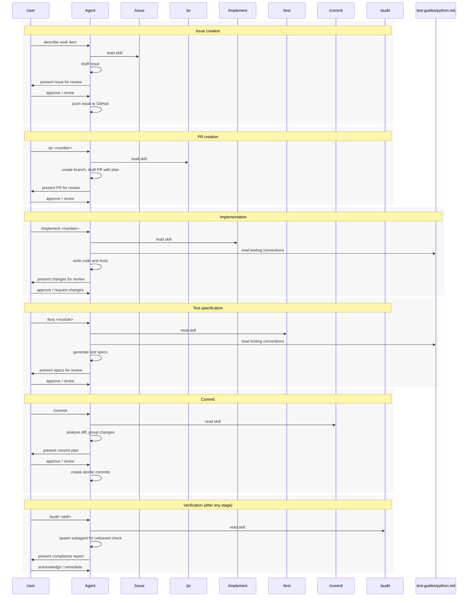

# Contributing to Wool

This directory contains skill definitions and guides that form a structured software development lifecycle (SDLC) pipeline for LLM agents working on the `wool` codebase. It is the canonical source for all pipeline behaviour — agent skills should be symlinked here.

## Human-in-the-loop philosophy

Every skill in this pipeline is collaborative, not autonomous. The LLM agent proposes; the human disposes. Concretely:

- The agent reads a skill document, performs the described work, and presents the result to the user.
- The user reviews, approves, requests changes, or overrides any decision.
- No destructive or externally-visible action (push, PR creation, issue filing) proceeds without explicit user approval.
- The `/audit` skill exists specifically to give the user an independent compliance check after any other skill runs.

## Directory layout

```
llms/
├── README.md            ← you are here
├── skills/              ← LLM-agnostic skill definitions (portable)
│   ├── issue.md         ← /issue — draft and push a GitHub issue
│   ├── pr.md            ← /pr — create a branch and draft PR from an issue
│   ├── implement.md     ← /implement — implement a planned PR or issue
│   ├── test.md          ← /test — generate test specifications
│   ├── commit.md        ← /commit — stage and commit changes atomically
│   ├── review.md        ← /review — review a PR for compliance and quality
│   └── audit.md         ← /audit — post-skill compliance checker
├── dispatchers/         ← harness-specific subagent dispatch wrappers
│   └── claude/          ← Claude Code dispatchers
│       ├── issue.md
│       ├── implement.md
│       ├── test.md
│       ├── commit.md
│       ├── pr.md
│       ├── review.md
│       └── audit.md
├── test-guides/
│   └── python.md        ← Python testing conventions
└── style-guides/
    └── markdown.md      ← Markdown styling conventions
```

## Pipeline overview

The typical development flow follows this sequence:

1. **`/issue`** — Capture the work item as a GitHub issue with acceptance criteria.
2. **`/pr`** — Create a feature branch and open a draft PR linked to the issue, including an implementation plan.
3. **`/implement`** — Execute the implementation plan: write code, guided by guides (e.g., `python.md` for test conventions).
4. **`/test`** — Generate test specifications covering public APIs of new or changed modules.
5. **`/commit`** — Stage and commit changes in disciplined, atomic commits grouped by logical kind.
6. **`/pr` (update)** — Update the draft PR description and mark it ready for review.

**`/audit`** is a cross-cutting quality gate. It can be invoked after any skill (`/audit commit`, `/audit implement`, etc.) to spawn a fresh subagent that independently checks whether the skill's requirements were met.



## Skill and guide reference

### Skills

| Skill | Invocation | Purpose |
|-------|-----------|---------|
| [issue.md](skills/issue.md) | `/issue` | Draft and push a GitHub issue. Uses `.issue.md` if present, otherwise drafts interactively. |
| [pr.md](skills/pr.md) | `/pr <number>` | Create a feature branch and draft PR from a GitHub issue, with an implementation plan in the PR body. |
| [implement.md](skills/implement.md) | `/implement <number>` | Resolve a PR or issue number to a draft PR, check out the branch, and enter plan mode to design and execute the implementation. |
| [test.md](skills/test.md) | `/test` | Generate comprehensive Given-When-Then test specifications for source modules, targeting 100% coverage of public APIs. |
| [commit.md](skills/commit.md) | `/commit` | Analyse the working tree diff, group changes by logical kind, and create disciplined atomic commits with conventional-commit messages. |
| [audit.md](skills/audit.md) | `/audit <skill>` | Spawn an independent subagent to evaluate whether a skill's MUST/SHALL requirements were met, using binary checklist decomposition. |

### Test guides

| Guide | Used by | Purpose |
|-------|---------|---------|
| [python.md](test-guides/python.md) | `/implement`, `/test` | Python testing conventions covering pytest, pytest-asyncio, pytest-mock, and Hypothesis. Language-specific but project-agnostic. |

### Style guides

The `style-guides/` directory contains format-specific authoring conventions (e.g., Markdown, YAML). These are **always-on context** — agents MUST read every file in `llms/style-guides/` at the start of a session and treat their rules as active constraints. The directory may be empty; if so, agents SHOULD default to following established convention already present in the codebase.

## Dispatchers

The `dispatchers/` directory contains harness-specific wrappers that execute each skill inside a subagent. Dispatchers are organized by harness — e.g., `dispatchers/claude/` for Claude Code. Each dispatcher spawns a dedicated subagent, passes it the corresponding skill definition from `skills/`, and relays the summary back to the parent context. This keeps the parent conversation clean — only the final summary and next-step prompt appear, while all intermediate tool calls (file reads, diffs, git operations) stay isolated in the subagent.

The skill definitions in `skills/` remain LLM-agnostic and portable. The dispatchers are the harness layer — they contain orchestration instructions specific to the coding assistant's subagent mechanism. Adding support for a new harness means creating a new subdirectory under `dispatchers/` with harness-specific wrappers that delegate to the same skill definitions.

## Registration mechanism

Each agentic coding assistant has its own convention for discovering skills and instructions. The registration mechanism bridges the canonical `llms/` content into whatever directory structure a given tool expects, typically via symlinks or config files. Symlinks point to dispatchers (not directly to skills) so that every invocation runs in a subagent. For example, an assistant that discovers skills in `.assistant/skills/` would have symlinks like:

```
.assistant/skills/commit.md    → ../../llms/dispatchers/<harness>/commit.md
.assistant/skills/implement.md → ../../llms/dispatchers/<harness>/implement.md
```

Guides are similarly symlinked where needed (e.g., `.assistant/skills/implement/TESTGUIDE.md → ../../../llms/test-guides/python.md`). This keeps the canonical content in `llms/` while letting each tool's skill discovery find it automatically.
