**Wool** is a distributed Python runtime that executes tasks in a horizontally scalable pool of agnostic worker processes without introducing a centralized scheduler or control plane. Instead, Wool routines are dispatched directly to a decentralized peer-to-peer network of workers. Cluster lifecycle and node orchestration can remain with purpose-built tools like Kubernetes — Wool focuses solely on distributed execution.

Any async function or generator can be made remotely executable with a single decorator. Serialization, routing, and transport are handled automatically. From the caller’s perspective, the function retains its original async semantics — return types, streaming, cancellation, and exceptions all behave as expected.

Wool provides best-effort, at-most-once execution. There is no built-in coordination state, retry logic, or durable task tracking. Those concerns remain application-defined.

## Installation

### Using pip

```sh
pip install --pre wool
```

### Cloning from GitHub

```sh
git clone https://github.com/wool-labs/wool.git
cd wool
pip install ./wool
```

## Quick start

```python
import asyncio
import wool


@wool.routine
async def add(x: int, y: int) -> int:
    return x + y


async def main():
    async with wool.WorkerPool(size=4):
        result = await add(1, 2)
        print(result)  # 3


asyncio.run(main())
```

## Routines

A Wool routine is an async function decorated with `@wool.routine`. When called, the function is serialized and dispatched to a worker in the pool, with the result streamed back to the caller.

```python
@wool.routine
async def fib(n: int) -> int:
    if n <= 1:
        return n
    async with asyncio.TaskGroup() as tg:
        a = tg.create_task(fib(n - 1))
        b = tg.create_task(fib(n - 2))
    return a.result() + b.result()
```

Async generators are also supported for streaming results:

```python
@wool.routine
async def fib(n: int):
    a, b = 0, 1
    for _ in range(n):
        yield a
        a, b = b, a + b
```

The decorated function, its arguments, returned or yielded values, and exceptions must all be serializable via `cloudpickle`. Instance, class, and static methods are all supported.

## Worker pools

`WorkerPool` is the main entry point for running routines. It orchestrates worker subprocess lifecycles, discovery, and load-balanced dispatch. The pool supports four configurations depending on which arguments are provided:

| Mode | `size` | `discovery` | Behavior |
| ---- | ------ | ----------- | -------- |
| Default | omitted | omitted | Spawns `cpu_count` local workers with internal `LocalDiscovery`. |
| Ephemeral | set | omitted | Spawns N local workers with internal `LocalDiscovery`. |
| Durable | omitted | set | No workers spawned; connects to existing workers via discovery. |
| Hybrid | set | set | Spawns local workers and discovers remote workers through the same protocol. |

**Default** — no arguments needed:

```python
async with wool.WorkerPool():
    result = await my_routine()
```

**Ephemeral** — spawn a fixed number of local workers, optionally with tags:

```python
async with wool.WorkerPool("gpu-capable", size=4):
    result = await gpu_task()
```

**Durable** — connect to workers already running on the network:

```python
async with wool.WorkerPool(discovery=wool.LanDiscovery()):
    result = await my_routine()
```

**Hybrid** — spawn local workers and discover remote ones:

```python
async with wool.WorkerPool(size=4, discovery=wool.LanDiscovery()):
    result = await my_routine()
```

`size` controls how many workers are spawned by the pool — it does not cap the total number of workers available. In Hybrid mode, additional workers may join via discovery beyond the initial `size`.

## Discovery

Discovery separates publishing (announcing worker lifecycle events) from subscribing (reacting to them). Wool ships with two protocols:

- **`LocalDiscovery`** — shared-memory IPC for single-machine pools. This is the default when no discovery is specified.
- **`LanDiscovery`** — Zeroconf DNS-SD (`_wool._tcp.local.`) for network-wide discovery. No central coordinator required.

Custom discovery protocols are supported via structural subtyping — implement the `DiscoveryLike` protocol and pass it to `WorkerPool`.

## Load balancing

The load balancer decides which worker handles each dispatched task. Wool ships with `RoundRobinLoadBalancer` (the default), which cycles through workers and handles transient errors by retrying on the next worker.

Custom load balancers are supported via structural subtyping — implement the `LoadBalancerLike` protocol and pass it to `WorkerPool`:

```python
async with wool.WorkerPool(size=4, loadbalancer=my_balancer):
    result = await my_routine()
```

## Security

`WorkerCredentials` provides mTLS or one-way TLS for gRPC connections between proxies and workers:

```python
creds = wool.WorkerCredentials.from_files(
    ca_path="certs/ca-cert.pem",
    key_path="certs/worker-key.pem",
    cert_path="certs/worker-cert.pem",
    mutual=True,
)

async with wool.WorkerPool(size=4, credentials=creds):
    result = await my_routine()
```

## Error handling

Exceptions raised within a routine are captured as a `TaskException` and re-raised on the caller side, preserving the original exception type and traceback:

```python
try:
    result = await my_routine()
except ValueError as e:
    print(f"Task failed: {e}")
```

If every worker in the pool fails or is unavailable, `NoWorkersAvailable` is raised.

## Architecture

The following diagram shows the full lifecycle of a wool worker pool — from startup and discovery through task dispatch to teardown.

```mermaid
sequenceDiagram
    participant Client
    participant Routine
    participant Pool
    participant Discovery
    participant Loadbalancer
    participant Worker

    %% -- 1. Pool startup --
    rect rgb(0, 0, 0, 0)
        Note over Client, Discovery: Worker pool startup

        Client ->> Pool: create pool (size, discovery, loadbalancer)
        activate Client
        Pool ->> Pool: resolve mode from size and discovery

        opt If size specified, spawn ephemeral workers
            loop Per worker
                Pool ->> Worker: spawn worker
                Worker ->> Worker: start process, bind gRPC server
                Worker -->> Pool: worker metadata (host, port, tags)
                Pool ->> Discovery: publish "worker added"
            end
        end

        Pool ->> Pool: create proxy (discovery subscriber, loadbalancer)
        Pool -->> Client: pool ready
        deactivate Client
    end

    %% -- 2. Discovery --
    rect rgb(0, 0, 0, 0)
        Note over Discovery, Loadbalancer: Worker discovery

        par Worker discovery
            loop Per worker lifecycle event
                Discovery -->> Loadbalancer: worker event
                activate Discovery
                alt Worker-added
                    Loadbalancer ->> Loadbalancer: add worker
                else Worker-updated
                    Loadbalancer ->> Loadbalancer: update worker
                else Worker-dropped
                    Loadbalancer ->> Loadbalancer: remove worker
                end
                deactivate Discovery
            end
        end
    end

    %% -- 3. Task dispatch --
    rect rgb(0, 0, 0, 0)
        Note over Client, Worker: Task dispatch

        Client ->> Routine: invoke wool routine
        activate Client
        Routine ->> Routine: create task
        Routine ->> Loadbalancer: route task
        Loadbalancer ->> Loadbalancer: serialize task to protobuf

        loop Until success or all workers exhausted
            Loadbalancer ->> Loadbalancer: select next worker
            Loadbalancer ->> Worker: dispatch via gRPC
            alt Success
                Worker -->> Loadbalancer: ack
                Loadbalancer ->> Loadbalancer: break
            else Transient error
                Loadbalancer ->> Loadbalancer: continue
            else Non-transient error
                Loadbalancer ->> Loadbalancer: remove worker, continue
            end
        end
        opt All workers exhausted without success
            Loadbalancer -->> Client: raise NoWorkersAvailable
        end

        Worker ->> Worker: deserialize task, execute callable, serialize result(s)

        alt Coroutine
            Worker -->> Routine: serialized result
            Routine ->> Routine: deserialize result
            Routine -->> Client: return result
        else Async generator (bidirectional)
            loop Each iteration
                Client ->> Routine: next / send / throw
                Routine ->> Worker: iteration request [gRPC write]
                Worker ->> Worker: advance generator
                Worker -->> Routine: serialized result [gRPC read]
                Routine ->> Routine: deserialize result
                Routine -->> Client: yield result
            end
        else Exception
            Worker -->> Routine: serialized exception
            Routine ->> Routine: deserialize exception
            Routine -->> Client: re-raise exception
        end
        deactivate Client
    end

    %% -- 4. Teardown --
    rect rgb(0, 0, 0, 0)
        Note over Client, Discovery: Worker pool teardown

        Client ->> Pool: exit pool
        activate Client

        Pool ->> Pool: stop proxy

        opt Stop ephemeral workers
            loop Per worker
                Pool ->> Discovery: publish "worker dropped"
                Discovery -->> Loadbalancer: worker event
                Loadbalancer ->> Loadbalancer: remove worker
                Pool ->> Worker: stop worker
                Worker ->> Worker: stop service, exit process
            end
        end

        Pool ->> Discovery: close discovery
        Pool -->> Client: pool exited
        deactivate Client
    end
```



## License

This project is licensed under the Apache License Version 2.0.
