**Wool** is a distributed Python runtime that executes tasks in a horizontally scalable pool of agnostic worker processes without introducing a centralized scheduler or control plane. Instead, Wool routines are dispatched directly to a decentralized peer-to-peer network of workers. Cluster lifecycle and node orchestration can remain with purpose-built tools like Kubernetes — Wool focuses solely on distributed execution.

Any async function or generator can be made remotely executable with a single decorator. Serialization, routing, and transport are handled automatically. From the caller's perspective, the function retains its original async semantics — return types, streaming, cancellation, and exceptions all behave as expected.

Wool provides best-effort, at-most-once execution. There is no built-in coordination state, retry logic, or durable task tracking. Those concerns remain application-defined.

## Installation

### Using pip

```sh
pip install wool
```

Wool publishes release candidates for major and minor releases, use the `--pre` flag to install them:

```sh
pip install --pre wool
```

### Cloning from GitHub

```sh
git clone https://github.com/wool-labs/wool.git
cd wool
pip install ./wool
```

## Quick start

```python
import asyncio
import wool


@wool.routine
async def add(x: int, y: int) -> int:
    return x + y


async def main():
    async with wool.WorkerPool(spawn=4):
        result = await add(1, 2)
        print(result)  # 3


asyncio.run(main())
```

## Routines

A Wool routine is an async function decorated with `@wool.routine`. When called, the function is serialized and dispatched to a worker in the pool, with the result streamed back to the caller. Invocation is transparent — you call a routine like any async function, with no special method required. For coroutines, `routine(args)` returns a coroutine and dispatch occurs on `await`. For async generators, `routine(args)` returns an async generator and dispatch occurs on first iteration.

```python
@wool.routine
async def fib(n: int) -> int:
    if n <= 1:
        return n
    async with asyncio.TaskGroup() as tg:
        a = tg.create_task(fib(n - 1))
        b = tg.create_task(fib(n - 2))
    return a.result() + b.result()
```

Async generators are also supported for streaming results:

```python
@wool.routine
async def fib(n: int):
    a, b = 0, 1
    for _ in range(n):
        yield a
        a, b = b, a + b
```

The decorated function, its arguments, returned or yielded values, and exceptions must all be serializable via `cloudpickle`. Instance, class, and static methods are all supported.

### Dispatch gate

Under the hood, the `@wool.routine` decorator replaces the function with a wrapper that checks a `do_dispatch` context variable. This is a `ContextVar[bool]` that defaults to `True` and acts as a dispatch gate — when `True`, calling a routine packages the call into a task and sends it to a remote worker. Workers set `do_dispatch` to `False` before executing the function body, preventing infinite re-dispatch. The variable is restored to `True` for any nested `@wool.routine` calls within the function, so those dispatch normally to other workers.

### Coroutines vs. async generators

Coroutines and async generators follow different dispatch paths. A coroutine dispatches as a single request-response: the worker runs the function and returns one result. An async generator uses pull-based bidirectional streaming: the client sends `next`/`send`/`throw` commands, the worker advances the generator one step per command and streams each yielded value back. The worker pauses between yields until the client requests the next value.

## Tasks

A task is a dataclass that encapsulates everything needed for remote execution: a unique ID, the async callable, its args/kwargs, a serialized `WorkerProxy` (enabling the receiving worker to dispatch its own tasks to peers), an optional timeout, and caller-tracking for nested tasks. Tasks are created automatically when a `@wool.routine`-decorated function is invoked — you never construct one manually.

### Nested task tracking

When a task is created inside an already-executing task, the new task automatically captures the parent task's UUID into its own `caller` field. This builds a parent-to-child chain so the system can trace which task spawned which.

### Proxy serialization

Each task carries a serialized `WorkerProxy`. When a task executes on a remote worker, it may call other `@wool.routine` functions (nested dispatch). The deserialized proxy is set as the worker's active proxy context variable, giving the remote task the ability to dispatch sub-tasks to other workers in the pool.

### Serialization

Task serialization has two layers. [cloudpickle](https://github.com/cloudpipe/cloudpickle) serializes Python objects — the callable, args, kwargs, and proxy — into bytes. cloudpickle is used instead of the standard `pickle` module because it can serialize objects that `pickle` cannot, including interactively-defined functions, closures, and lambdas. This is essential because `@wool.routine`-decorated functions and their arguments must be fully serializable for transmission to arbitrary worker processes.

[Protocol Buffers](https://protobuf.dev/) provides the wire format. Scalar task metadata (id, caller, tag, timeout) maps directly to protobuf fields, while Python-specific objects are nested as cloudpickle byte blobs. The protobuf definitions in the `proto/` directory define the gRPC wire protocol for task dispatch, acknowledgment, and result streaming between workers.

## Context propagation

Python's `contextvars.ContextVar` cannot be pickled — it's a C extension type that explicitly blocks serialization — so ambient state has no built-in way to cross process boundaries. `wool.ContextVar` solves this by mirroring the stdlib API (`get`, `set`, `reset`) and adding automatic propagation across the dispatch chain.

```python
import asyncio

import wool

tenant_id: wool.ContextVar[str] = wool.ContextVar("tenant_id", default="unknown")


@wool.routine
async def handle_request() -> str:
    return tenant_id.get()


async def main():
    async with wool.WorkerPool(spawn=2):
        token = tenant_id.set("acme-corp")
        try:
            result = await handle_request()
            print(result)  # "acme-corp" — propagated to the worker
        finally:
            tenant_id.reset(token)


asyncio.run(main())
```

Two construction modes are supported:

- `wool.ContextVar("name")` — no default; `get()` raises `LookupError` until a value is set.
- `wool.ContextVar("name", default=...)` — `get()` returns the default when the variable has no value in the current context.

`set()` returns a `Token` whose `reset()` restores the prior value (or the default if none was set), mirroring the stdlib `contextvars` API. Tokens are single-use across the logical chain — see Limitations below for the cross-task and cross-process scoping rules.

Each var's namespace is inferred from the top-level package of the calling frame, producing a `"<namespace>:<name>"` key that is stable across every process in the cluster. Library authors constructing vars from shared factory code should pass `namespace=` explicitly to avoid collisions with application-scope vars under the same package.

### How propagation works

At dispatch time, Wool snapshots only the vars that have been explicitly `set()` in the current `wool.Context` — default-only values are not shipped. The snapshot is assembled in O(k) time by iterating the per-Context data dict (which contains only explicitly-set vars), not the full process-wide registry. It rides every dispatch frame as a `Context` protobuf message carrying a `map<string, bytes>` keyed by each var's `"<namespace>:<name>"`, alongside the active `wool.Context` id that identifies the logical chain.

`wool.ContextVar.__reduce__` embeds the var's current value directly in the reduce tuple, so when a `wool.ContextVar` appears anywhere in a pickled object graph its value travels with it. References across a task's args, kwargs, and ContextVar snapshot all land on the same local instance on the receiver. Unpickling goes through a strict construction path: if no var is yet registered under the key, a "stub" instance is registered through an internal back-door that bypasses the duplicate-key check, and the var's value is applied from the wire; when the worker's module-scope constructor later runs, it promotes the stub in place, preserving any wire state and reference identity.

On the worker, each task is activated in its own `wool.Context` carrying the caller's chain id and the caller's propagated values, distinct from any concurrent task's `wool.Context` on the same worker. When the worker returns (or yields), the final var state is attached to the gRPC response and applied on the caller side, so worker-side mutations flow back automatically. For async generators, the caller also attaches its current context to each iteration request, enabling bidirectional state exchange between caller and worker at every yield/next boundary.

### Isolation

Each dispatched task runs inside its own `wool.Context`, carrying the caller's chain id and the caller's propagated values. Concurrent tasks on the same worker with different values for the same variable never interfere — each sees only its own propagated state. Worker-side mutations (via `set()`) are back-propagated to the caller when the task returns or yields, but they do not leak to other concurrent tasks: each dispatch activates its own `wool.Context` on the worker, and `asyncio.create_task` children fork a copy of the parent's `wool.Context` on creation (mirroring `contextvars.copy_context()` semantics), so concurrent execution paths do not share a mutable `wool.Context` and bidirectional value propagation stays coherent under the transparent-dispatch model.

### Decode failure semantics

Context propagation is **ancillary state** in wool's wire protocol — a separate channel from the routine's primary signal (its return value or raised exception). When a wire context fails to decode (cross-version pickle skew, custom class missing on the receiver, on-wire corruption of a single var value), wool never preempts the primary signal to surface the ancillary failure. The routine's outcome is delivered, and the failure is reported via Python's standard `warnings` mechanism with a `wool.ContextDecodeWarning` so callers can decide how to respond.

Three modes are available, and they compose with the standard Python warnings system rather than wool-specific API:

| Mode | How to enable | Behavior |
| ---- | ------------- | -------- |
| Lenient (default) | _no opt-in_ | Decode failure emits `wool.ContextDecodeWarning`; primary signal returned. Caller-side exception frames also receive the failure on `__notes__`. |
| Inspect | `warnings.catch_warnings(record=True)` | Decode failure captured into a list; primary signal returned. Standard pattern for "best effort with audit trail". |
| Strict | `warnings.filterwarnings("error", category=wool.ContextDecodeWarning)` | Decode failure raises (the warning is promoted to an exception); primary signal lost. |

The lenient default keeps wool useful for callers that treat tracing-style state as advisory. Strict mode is for callers whose correctness depends on context state and prefer to fail fast. Inspect mode is the right choice when you want both the primary signal and visibility into ancillary failures:

```python
import warnings
import wool

with warnings.catch_warnings(record=True) as captured:
    warnings.simplefilter("always", category=wool.ContextDecodeWarning)
    result = await some_routine()  # always returns
    decode_failures = [w for w in captured if issubclass(w.category, wool.ContextDecodeWarning)]
if decode_failures:
    log.warning("context propagation degraded for %d frame(s)", len(decode_failures))
```

The same semantics apply on both sides of the wire: the worker emits `ContextDecodeWarning` when a request context fails to decode (and runs the routine with a fresh empty context as fallback), and the caller emits `ContextDecodeWarning` when a response context fails to decode (and delivers the result anyway). On the caller side, an exception-frame decode failure additionally rides on the routine's exception via `__notes__` so the failure surfaces in tracebacks. On the worker side, a snapshot encode failure that coincides with a routine exception rides similarly on the routine exception via `__notes__`. There is no `ExceptionGroup` chaining and no wrapper-exception API to learn — just a standard warning class and standard `try/except` around primary signals.

#### Worker-side strict mode

Strict mode applies symmetrically on the worker side via Python's standard `PYTHONWARNINGS` environment variable, which `multiprocessing` propagates to spawned worker subprocesses by default:

```bash
export PYTHONWARNINGS="error::wool.ContextDecodeWarning"
python my_app.py
```

Or programmatically before constructing the pool:

```python
import os
os.environ["PYTHONWARNINGS"] = "error::wool.ContextDecodeWarning"

import wool

async with wool.WorkerPool():
    ...   # workers spawned now promote the warning to an exception
```

When the worker promotes the warning to an exception, wool ships it back through the routine-exception channel, so the caller catches the exact same `wool.ContextDecodeWarning` class — symmetric with caller-side strict mode. No `RpcError` to special-case, no out-of-band wire metadata.

### Binding a `wool.Context` to a task

The canonical way to bind a `wool.Context` to a freshly-spawned `asyncio.Task` is `wool.create_task` (typed shim) or `asyncio.create_task` (or `loop.create_task`) directly with `context=wool_ctx`:

```python
ctx = wool.copy_context()
task = wool.create_task(some_coro(), context=ctx)
# Equivalent at runtime:
task = asyncio.create_task(some_coro(), context=ctx)  # type: ignore[arg-type]
```

Both forms route through Wool's task factory, which self-installs on the running loop the first time any Wool API is touched (or on demand via `wool.install_task_factory(loop)`). The factory wraps the coroutine so the `wool.Context`'s single-task guard is held continuously across awaits — any concurrent attempt to bind a second task to the same `wool.Context` raises `RuntimeError` immediately when that task starts running. `wool.create_task` exists purely as a typing shim: stdlib's `context=` kwarg is typed for `contextvars.Context` and `wool.Context` cannot subclass it (the C type disallows subclassing), so the Wool helper hides the cast.

When `context=` is omitted, the factory forks `wool.copy_context()` from the parent task and binds the fresh chain id to the child. This is the default `asyncio.create_task(coro)` path and matches stdlib's `contextvars.copy_context()` semantics with wool's chain-id contract layered on top.

### Backpressure hooks

`BackpressureLike` hooks run after the caller's propagated `wool.ContextVar` snapshot is applied to the worker's context, so a hook can read caller-provided values (e.g., a tenant id) to make admission decisions without the caller having to plumb them through the `BackpressureContext` explicitly.

### Limitations

- **Values must be _cloudpicklable_.** A `TypeError` naming the offending variable is raised at dispatch time if serialization fails.
- **Only explicitly set values propagate.** A variable that has never been `set()` (only has a class-level default) is not included in the snapshot — the worker falls through to its own default.
- **Receivers must eventually declare the var.** Until the worker imports the module that constructs the var, the wire-shipped value is held on a stub pinned to the receiver `wool.Context`; a later `wool.ContextVar(...)` declaration promotes the stub and the propagated value applies transparently. If the worker never declares the var, the stub is collected with its receiver `wool.Context` and the value is dropped.
- **Tokens are scoped to their originating `wool.Context`.** A `Token` minted inside a task cannot be reset from outside that `wool.Context` — including after crossing an `asyncio.create_task` fork boundary, since child tasks receive fresh `wool.Context` ids. Reset the token in the same logical chain that produced it, or use `var.set(...)` to install a new value without relying on the token.
- **Wire keys are tied to the top-level package name.** Renaming the top-level package (e.g., `myapp` → `myapp_v2`) changes every var's wire key, so a rolling deploy that has callers and workers on different top-level names will silently drop propagated values on the mismatched side. Keep the top-level package name stable across rolling deploys, or bridge the transition with explicit `namespace=` overrides. Moving a module deeper within the same top-level package is safe — the key is the package root, not the full module path.

## Worker pools

`WorkerPool` is the main entry point for running routines. It orchestrates worker subprocess lifecycles, discovery, and load-balanced dispatch. The pool supports four configurations depending on which arguments are provided:

| Mode | `spawn` | `discovery` | `lease` | Behavior |
| ---- | ------- | ----------- | ------- | -------- |
| Default | omitted | omitted | optional | Spawns `cpu_count` local workers with internal `LocalDiscovery`. |
| Ephemeral | set | omitted | optional | Spawns N local workers with internal `LocalDiscovery`. |
| Durable | omitted | set | optional | No workers spawned; connects to existing workers via discovery. |
| Hybrid | set | set | optional | Spawns local workers and discovers remote workers through the same protocol. |

**Default** — no arguments needed:

```python
async with wool.WorkerPool():
    result = await my_routine()
```

**Ephemeral** — spawn a fixed number of local workers, optionally with tags:

```python
async with wool.WorkerPool("gpu-capable", spawn=4):
    result = await gpu_task()
```

**Durable** — connect to workers already running on the network:

```python
async with wool.WorkerPool(discovery=wool.LanDiscovery()):
    result = await my_routine()
```

**Hybrid** — spawn local workers and discover remote ones:

```python
async with wool.WorkerPool(spawn=4, discovery=wool.LanDiscovery()):
    result = await my_routine()
```

`spawn` controls how many workers the pool starts — it does not cap the total number of workers available. In Hybrid mode, additional workers may join via discovery beyond the initial `spawn`.

`lease` caps how many additionally discovered workers the pool will admit. The total pool capacity is `spawn + lease` when both are set, or just `lease` for discovery-only pools. Defaults to `None` (unbounded). The lease count is a cap on admission, not a reservation — discovered workers may serve multiple pools simultaneously, and there is no guarantee that a leased slot will remain filled for the life of the pool.

```python
# Spawn 4 local workers, accept up to 4 more from discovery (8 total)
async with wool.WorkerPool(spawn=4, lease=4, discovery=wool.LanDiscovery()):
    result = await my_routine()

# Durable pool capped at 10 discovered workers
async with wool.WorkerPool(discovery=wool.LanDiscovery(), lease=10):
    result = await my_routine()
```

`lazy` controls whether the pool's internal `WorkerProxy` defers startup until the first task is dispatched. Defaults to `True`. The pool propagates this flag to every `WorkerProxy` it constructs, and each task serializes the proxy (including the flag) so that workers receiving the task inherit the same laziness setting. With `lazy=True`, worker subprocesses that never invoke nested `@wool.routine` calls avoid the cost of discovery subscription and worker-sentinel task setup entirely. Set `lazy=False` to start proxies eagerly — useful when you want connections established before the first dispatch.

```python
# Eager proxy startup — connections established before first dispatch
async with wool.WorkerPool(spawn=4, lazy=False):
    result = await my_routine()
```

## Workers

A worker is a separate OS process hosting a gRPC server with two RPCs: `dispatch` (bidirectional streaming for task execution) and `stop` (graceful shutdown). Tasks execute on a dedicated asyncio event loop in a separate daemon thread, so that long-running or CPU-intensive task code does not block the main gRPC event loop. This keeps the worker responsive to new dispatches, stop requests, and concurrent streaming interactions with in-flight tasks.

The dispatch RPC uses bidirectional streaming — both client and server send messages on the same gRPC stream concurrently. The client sends a task submission, then iteration commands (`next`, `send`, `throw`) for generators. The server sends an acknowledgment, then result or exception frames. This enables pull-based flow control where the client dictates pacing.

## Discovery

Workers discover each other through pluggable discovery backends with no central coordinator. Each worker carries a full `WorkerProxy` enabling direct peer-to-peer task dispatch — every node is both client and server. Discovery separates publishing (announcing worker lifecycle events) from subscribing (reacting to them).

### Discovery events

A `DiscoveryEvent` pairs a type — one of `worker-added`, `worker-dropped`, or `worker-updated` — with the affected worker's `WorkerMetadata` (UID, address, pid, version, tags, security flag, and transport options). Discovery subscribers yield these events as the set of known workers changes.

### Built-in protocols

Wool ships with two discovery protocols:

- **`LocalDiscovery`** — shared-memory IPC for single-machine pools. Publishers write worker metadata into a named shared memory region (`multiprocessing.SharedMemory`), using cross-process file locking (`portalocker`) for synchronization. Subscribers attach to the same region, diff its contents against a local cache, and emit discovery events for changes. A notification file touched by publishers after each write wakes subscribers via `watchdog` filesystem monitoring, with optional fallback polling. This is the default when no discovery is specified.

- **`LanDiscovery`** — Zeroconf DNS-SD (`_wool._tcp.local.`) for network-wide discovery. Publishers register, update, and unregister `ServiceInfo` records via `AsyncZeroconf`. Subscribers use `AsyncServiceBrowser` to listen for service changes and convert Zeroconf callbacks into Wool `DiscoveryEvent`s. No central coordinator or shared state is required.

Custom discovery protocols are supported via structural subtyping — implement the `DiscoveryLike` protocol and pass it to `WorkerPool`.

## Load balancing

The load balancer decides which worker handles each dispatched task. The `WorkerProxy` maintains a load balancer and a context of discovered workers with gRPC connections. It waits for at least one worker to become available, then the load balancer selects one.

Wool ships with `RoundRobinLoadBalancer` (the default), which maintains a per-context index that cycles through the ordered worker list. On each dispatch it tries the worker at the current index: on success, it advances the index and returns the result stream; on transient error, it skips to the next worker; on non-transient error, it evicts the worker from the context. It gives up after one full cycle of all workers.

Custom load balancers are supported via structural subtyping — implement the `LoadBalancerLike` protocol and pass it to `WorkerPool`:

```python
async with wool.WorkerPool(spawn=4, loadbalancer=my_balancer):
    result = await my_routine()
```

### Transient vs. non-transient errors

Transient errors are the gRPC status codes `UNAVAILABLE`, `DEADLINE_EXCEEDED`, and `RESOURCE_EXHAUSTED` — temporary conditions that may resolve on retry to the same or another worker. Non-transient errors are all other gRPC failures (e.g., `INVALID_ARGUMENT`, `PERMISSION_DENIED`) indicating persistent problems. The load balancer skips transient-error workers but evicts non-transient-error workers from the pool.

### Self-describing worker connections

Workers are self-describing: each worker advertises its gRPC transport configuration via `ChannelOptions` in its `WorkerMetadata`. When a client discovers a worker, it reads the advertised options and configures its channel to match — message sizes, keepalive intervals, concurrency limits, and compression are all set automatically. There is no separate client-side configuration step; the worker's metadata is the single source of truth for how to connect to it.

A `WorkerConnection` is a gRPC client managing a pooled channel to a single worker address. It serializes and sends a task over a bidirectional stream, waits for an acknowledgment, then returns an async generator that streams results back. The channel's concurrency semaphore is sized by the worker's advertised `max_concurrent_streams`, and gRPC errors are classified as transient or non-transient for the load balancer.

Channels are pooled with reference counting and a 60-second TTL. A dispatch acquires a pool reference, and the result stream holds its own reference to keep the channel alive during streaming. There is no pool-level health checking — dead channels are detected reactively when a dispatch attempt fails, and the failed worker is removed from the load balancer context by the error classification logic.

### Transport configuration

Transport options are split into two tiers:

- **`ChannelOptions`** — settings that both the server and client apply symmetrically. Workers advertise these via `WorkerMetadata` so clients connect with identical settings. Includes message sizes (`max_receive_message_length`, `max_send_message_length`), keepalive (`keepalive_time_ms`, `keepalive_timeout_ms`, `keepalive_permit_without_calls`, `max_pings_without_data`), flow control (`max_concurrent_streams`), and compression (`compression`).

- **`WorkerOptions`** — composes a `ChannelOptions` instance with server-only settings that are not communicated to clients: `http2_min_recv_ping_interval_without_data_ms` (minimum allowed client ping interval), `max_ping_strikes` (ping violations before GOAWAY), and optional connection lifecycle limits (`max_connection_idle_ms`, `max_connection_age_ms`, `max_connection_age_grace_ms`).

All options default to gRPC's own defaults. Pass a `WorkerOptions` instance to `LocalWorker` or `WorkerProcess` to customize:

```python
from wool.runtime.worker.base import ChannelOptions, WorkerOptions
from wool.runtime.worker.local import LocalWorker

options = WorkerOptions(
    channel=ChannelOptions(
        keepalive_time_ms=10_000,
        keepalive_timeout_ms=5_000,
        max_concurrent_streams=50,
    ),
    max_connection_idle_ms=300_000,
)

async with wool.WorkerPool(
    spawn=4,
    worker=lambda *tags, credentials=None: LocalWorker(
        *tags, credentials=credentials, options=options,
    ),
):
    result = await my_routine()
```

### Connection failure detection

gRPC runs over HTTP/2, which provides connection-level error signaling via GOAWAY and RST_STREAM frames. When a peer drops abruptly, the OS eventually closes the TCP socket and the HTTP/2 layer surfaces the broken connection to gRPC as a stream error.

Wool configures HTTP/2 keepalive pings on both client and server channels. When keepalive is enabled (the default), both sides send periodic PING frames and expect a PONG response within `keepalive_timeout_ms`. If no response arrives, the connection is considered dead and gRPC raises an error on the next operation. This detects silently dead connections — where the remote peer is unreachable but no TCP reset was received — without waiting for the next application-level read or write.

On the client side, a dead worker surfaces as `UNAVAILABLE` (transient), causing the load balancer to skip to the next worker. On the worker side, a disconnected client is detected when the stream iterator terminates, at which point the worker closes the running generator if one is active.

## Security

`WorkerCredentials` is a frozen dataclass holding PEM-encoded CA certificate, worker key, and worker cert bytes plus a `mutual` flag. It exposes `server_credentials` and `client_credentials` properties that produce the appropriate gRPC TLS objects. Workers bind a secure gRPC port when credentials are present, and proxies open secure channels to connect.

```python
creds = wool.WorkerCredentials.from_files(
    ca_path="certs/ca-cert.pem",
    key_path="certs/worker-key.pem",
    cert_path="certs/worker-cert.pem",
    mutual=True,
)

async with wool.WorkerPool(spawn=4, credentials=creds):
    result = await my_routine()
```

### Mutual TLS vs. one-way TLS

With mutual TLS (`mutual=True`), the server requires client authentication — both sides present and verify certificates signed by the same CA. With one-way TLS (`mutual=False`), the server presents its certificate for the client to verify, but the client remains anonymous at the transport layer. The `mutual` flag controls `require_client_auth` on the server and whether the client includes its key and cert when opening the channel.

### Discovery security filtering

Each `WorkerMetadata` carries a `secure` boolean flag set at startup based on whether the worker was given credentials. The `WorkerProxy` applies a security filter to discovery events: a proxy with credentials only accepts workers with `secure=True`, and a proxy without credentials only accepts workers with `secure=False`. This prevents secure proxies from connecting to insecure workers and vice versa, but does not guard against incompatible credentials between two secure peers (e.g., certificates signed by different CAs).

If a TLS handshake fails (e.g., incompatible, invalid, or expired certificates), gRPC surfaces it as an `RpcError`. The `WorkerConnection` classifies the error by status code using the same transient/non-transient logic as any other gRPC failure — there is no TLS-specific error handling path.

## Error handling

Two error paths exist. When a routine raises an exception, the worker serializes the original exception with cloudpickle, sends it back over the gRPC stream, and the caller deserializes and re-raises it — preserving the original type and traceback. When dispatch itself fails (worker unavailable, protocol mismatch, etc.), the load balancer classifies the gRPC error as transient or non-transient, tries the next worker, and raises `NoWorkersAvailable` if it exhausts the full cycle.

```python
try:
    result = await my_routine()
except ValueError as e:
    print(f"Task failed: {e}")
```

### Task exception transmission

The worker executes the task inside a context manager that captures any raised exception as a `TaskException` (storing the exception type and formatted traceback). The exception object is then serialized with cloudpickle into a gRPC response. This serialization is facilitated by [tbpickle](https://github.com/wool-labs/tbpickle), which makes stack frames picklable — without it, cloudpickle cannot serialize exception tracebacks. On the caller side, `WorkerConnection` deserializes the exception and re-raises it, so the caller receives the original exception as if it were raised locally.

### Version compatibility

A `VersionInterceptor` on each worker intercepts incoming dispatch RPCs and validates the client's protocol version against the worker's version. If versions are incompatible or unparseable, the worker responds with a `Nack` (negative acknowledgment) containing a reason string. The `WorkerConnection` converts a `Nack` into a non-transient error, causing the load balancer to evict the worker.

## Architecture

The following diagram shows the full lifecycle of a wool worker pool — from startup and discovery through task dispatch to teardown.

```mermaid
sequenceDiagram
    participant Client
    participant Routine
    participant Pool
    participant Discovery
    participant Loadbalancer
    participant Worker

    %% -- 1. Pool startup --
    rect rgb(0, 0, 0, 0)
        Note over Client, Worker: Worker pool startup

        Client ->> Pool: create pool (spawn, discovery, loadbalancer)
        activate Client
        Pool ->> Pool: resolve mode from spawn and discovery

        opt If spawn specified, spawn ephemeral workers
            loop Per worker
                Pool ->> Worker: spawn worker
                Worker ->> Worker: start process, bind gRPC server
                Worker -->> Pool: worker metadata (host, port, tags)
                Pool ->> Discovery: publish "worker added"
            end
        end

        Pool ->> Pool: create proxy (discovery subscriber, loadbalancer)
        Pool -->> Client: pool ready
        deactivate Client
    end

    %% -- 2. Discovery --
    rect rgb(0, 0, 0, 0)
        Note over Discovery, Loadbalancer: Worker discovery

        par Worker discovery
            loop Per worker lifecycle event
                Discovery -->> Loadbalancer: worker event
                activate Discovery
                alt Worker-added
                    Loadbalancer ->> Loadbalancer: add worker
                else Worker-updated
                    Loadbalancer ->> Loadbalancer: update worker
                else Worker-dropped
                    Loadbalancer ->> Loadbalancer: remove worker
                end
                deactivate Discovery
            end
        end
    end

    %% -- 3. Task dispatch --
    rect rgb(0, 0, 0, 0)
        Note over Client, Worker: Task dispatch

        Client ->> Routine: invoke wool routine
        activate Client
        Routine ->> Routine: create task
        Routine ->> Loadbalancer: route task
        Loadbalancer ->> Loadbalancer: serialize task to protobuf

        loop Until success or all workers exhausted
            Loadbalancer ->> Loadbalancer: select next worker
            Loadbalancer ->> Worker: dispatch via gRPC
            alt Success
                Worker -->> Loadbalancer: ack
                Loadbalancer ->> Loadbalancer: break
            else Transient error
                Loadbalancer ->> Loadbalancer: continue
            else Non-transient error
                Loadbalancer ->> Loadbalancer: remove worker, continue
            end
        end
        opt All workers exhausted without success
            Loadbalancer -->> Client: raise NoWorkersAvailable
        end

        Worker ->> Worker: deserialize task, execute callable, serialize result(s)

        alt Coroutine
            Worker -->> Routine: serialized result
            Routine ->> Routine: deserialize result
            Routine -->> Client: return result
        else Async generator (bidirectional)
            loop Each iteration
                Client ->> Routine: next / send / throw
                Routine ->> Worker: iteration request [gRPC write]
                Worker ->> Worker: advance generator
                Worker -->> Routine: serialized result [gRPC read]
                Routine ->> Routine: deserialize result
                Routine -->> Client: yield result
            end
        else Exception
            Worker -->> Routine: serialized exception
            Routine ->> Routine: deserialize exception
            Routine -->> Client: re-raise exception
        end
        deactivate Client
    end

    %% -- 4. Teardown --
    rect rgb(0, 0, 0, 0)
        Note over Client, Worker: Worker pool teardown

        Client ->> Pool: exit pool
        activate Client

        Pool ->> Pool: stop proxy

        opt Stop ephemeral workers
            loop Per worker
                Pool ->> Discovery: publish "worker dropped"
                Discovery -->> Loadbalancer: worker event
                Loadbalancer ->> Loadbalancer: remove worker
                Pool ->> Worker: stop worker
                Worker ->> Worker: stop service, exit process
            end
        end

        Pool ->> Discovery: close discovery
        Pool -->> Client: pool exited
        deactivate Client
    end
```



## License

This project is licensed under the Apache License Version 2.0.
