**Wool** is a distributed Python runtime that executes tasks in a horizontally scalable pool of agnostic worker processes without introducing a centralized scheduler or control plane. Instead, Wool routines are dispatched directly to a decentralized peer-to-peer network of workers. Cluster lifecycle and node orchestration can remain with purpose-built tools like Kubernetes — Wool focuses solely on distributed execution.

Any async function or generator can be made remotely executable with a single decorator. Serialization, routing, and transport are handled automatically. From the caller's perspective, the function retains its original async semantics — return types, streaming, cancellation, and exceptions all behave as expected.

Wool provides best-effort, at-most-once execution. There is no built-in coordination state, retry logic, or durable task tracking. Those concerns remain application-defined.

## Installation

### Using pip

```sh
pip install wool
```

Wool publishes release candidates for major and minor releases, use the `--pre` flag to install them:

```sh
pip install --pre wool
```

### Cloning from GitHub

```sh
git clone https://github.com/wool-labs/wool.git
cd wool
pip install ./wool
```

## Quick start

```python
import asyncio
import wool


@wool.routine
async def add(x: int, y: int) -> int:
    return x + y


async def main():
    async with wool.WorkerPool(size=4):
        result = await add(1, 2)
        print(result)  # 3


asyncio.run(main())
```

## Routines

A Wool routine is an async function decorated with `@wool.routine`. When called, the function is serialized and dispatched to a worker in the pool, with the result streamed back to the caller. Invocation is transparent — you call a routine like any async function, with no special method required. For coroutines, `routine(args)` returns a coroutine and dispatch occurs on `await`. For async generators, `routine(args)` returns an async generator and dispatch occurs on first iteration.

```python
@wool.routine
async def fib(n: int) -> int:
    if n <= 1:
        return n
    async with asyncio.TaskGroup() as tg:
        a = tg.create_task(fib(n - 1))
        b = tg.create_task(fib(n - 2))
    return a.result() + b.result()
```

Async generators are also supported for streaming results:

```python
@wool.routine
async def fib(n: int):
    a, b = 0, 1
    for _ in range(n):
        yield a
        a, b = b, a + b
```

The decorated function, its arguments, returned or yielded values, and exceptions must all be serializable via `cloudpickle`. Instance, class, and static methods are all supported.

### Dispatch gate

Under the hood, the `@wool.routine` decorator replaces the function with a wrapper that checks a `do_dispatch` context variable. This is a `ContextVar[bool]` that defaults to `True` and acts as a dispatch gate — when `True`, calling a routine packages the call into a task and sends it to a remote worker. Workers set `do_dispatch` to `False` before executing the function body, preventing infinite re-dispatch. The variable is restored to `True` for any nested `@wool.routine` calls within the function, so those dispatch normally to other workers.

### Coroutines vs. async generators

Coroutines and async generators follow different dispatch paths. A coroutine dispatches as a single request-response: the worker runs the function and returns one result. An async generator uses pull-based bidirectional streaming: the client sends `next`/`send`/`throw` commands, the worker advances the generator one step per command and streams each yielded value back. The worker pauses between yields until the client requests the next value.

## Tasks

A task is a dataclass that encapsulates everything needed for remote execution: a unique ID, the async callable, its args/kwargs, a serialized `WorkerProxy` (enabling the receiving worker to dispatch its own tasks to peers), an optional timeout, and caller-tracking for nested tasks. Tasks are created automatically when a `@wool.routine`-decorated function is invoked — you never construct one manually.

### Nested task tracking

When a task is created inside an already-executing task, the new task automatically captures the parent task's UUID into its own `caller` field. This builds a parent-to-child chain so the system can trace which task spawned which.

### Proxy serialization

Each task carries a serialized `WorkerProxy`. When a task executes on a remote worker, it may call other `@wool.routine` functions (nested dispatch). The deserialized proxy is set as the worker's active proxy context variable, giving the remote task the ability to dispatch sub-tasks to other workers in the pool.

### Serialization

Task serialization has two layers. [cloudpickle](https://github.com/cloudpipe/cloudpickle) serializes Python objects — the callable, args, kwargs, and proxy — into bytes. cloudpickle is used instead of the standard `pickle` module because it can serialize objects that `pickle` cannot, including interactively-defined functions, closures, and lambdas. This is essential because `@wool.routine`-decorated functions and their arguments must be fully serializable for transmission to arbitrary worker processes.

[Protocol Buffers](https://protobuf.dev/) provides the wire format. Scalar task metadata (id, caller, tag, timeout) maps directly to protobuf fields, while Python-specific objects are nested as cloudpickle byte blobs. The protobuf definitions in the `proto/` directory define the gRPC wire protocol for task dispatch, acknowledgment, and result streaming between workers.

## Worker pools

`WorkerPool` is the main entry point for running routines. It orchestrates worker subprocess lifecycles, discovery, and load-balanced dispatch. The pool supports four configurations depending on which arguments are provided:

| Mode | `size` | `discovery` | Behavior |
| ---- | ------ | ----------- | -------- |
| Default | omitted | omitted | Spawns `cpu_count` local workers with internal `LocalDiscovery`. |
| Ephemeral | set | omitted | Spawns N local workers with internal `LocalDiscovery`. |
| Durable | omitted | set | No workers spawned; connects to existing workers via discovery. |
| Hybrid | set | set | Spawns local workers and discovers remote workers through the same protocol. |

**Default** — no arguments needed:

```python
async with wool.WorkerPool():
    result = await my_routine()
```

**Ephemeral** — spawn a fixed number of local workers, optionally with tags:

```python
async with wool.WorkerPool("gpu-capable", size=4):
    result = await gpu_task()
```

**Durable** — connect to workers already running on the network:

```python
async with wool.WorkerPool(discovery=wool.LanDiscovery()):
    result = await my_routine()
```

**Hybrid** — spawn local workers and discover remote ones:

```python
async with wool.WorkerPool(size=4, discovery=wool.LanDiscovery()):
    result = await my_routine()
```

`size` controls how many workers are spawned by the pool — it does not cap the total number of workers available. In Hybrid mode, additional workers may join via discovery beyond the initial `size`.

## Workers

A worker is a separate OS process hosting a gRPC server with two RPCs: `dispatch` (bidirectional streaming for task execution) and `stop` (graceful shutdown). Tasks execute on a dedicated asyncio event loop in a separate daemon thread, so that long-running or CPU-intensive task code does not block the main gRPC event loop. This keeps the worker responsive to new dispatches, stop requests, and concurrent streaming interactions with in-flight tasks.

The dispatch RPC uses bidirectional streaming — both client and server send messages on the same gRPC stream concurrently. The client sends a task submission, then iteration commands (`next`, `send`, `throw`) for generators. The server sends an acknowledgment, then result or exception frames. This enables pull-based flow control where the client dictates pacing.

## Discovery

Workers discover each other through pluggable discovery backends with no central coordinator. Each worker carries a full `WorkerProxy` enabling direct peer-to-peer task dispatch — every node is both client and server. Discovery separates publishing (announcing worker lifecycle events) from subscribing (reacting to them).

### Discovery events

A `DiscoveryEvent` pairs a type — one of `worker-added`, `worker-dropped`, or `worker-updated` — with the affected worker's `WorkerMetadata` (UID, address, pid, version, tags, security flag). Discovery subscribers yield these events as the set of known workers changes.

### Built-in protocols

Wool ships with two discovery protocols:

- **`LocalDiscovery`** — shared-memory IPC for single-machine pools. Publishers write worker metadata into a named shared memory region (`multiprocessing.SharedMemory`), using cross-process file locking (`portalocker`) for synchronization. Subscribers attach to the same region, diff its contents against a local cache, and emit discovery events for changes. A notification file touched by publishers after each write wakes subscribers via `watchdog` filesystem monitoring, with optional fallback polling. This is the default when no discovery is specified.

- **`LanDiscovery`** — Zeroconf DNS-SD (`_wool._tcp.local.`) for network-wide discovery. Publishers register, update, and unregister `ServiceInfo` records via `AsyncZeroconf`. Subscribers use `AsyncServiceBrowser` to listen for service changes and convert Zeroconf callbacks into Wool `DiscoveryEvent`s. No central coordinator or shared state is required.

Custom discovery protocols are supported via structural subtyping — implement the `DiscoveryLike` protocol and pass it to `WorkerPool`.

## Load balancing

The load balancer decides which worker handles each dispatched task. The `WorkerProxy` maintains a load balancer and a context of discovered workers with gRPC connections. It waits for at least one worker to become available, then the load balancer selects one.

Wool ships with `RoundRobinLoadBalancer` (the default), which maintains a per-context index that cycles through the ordered worker list. On each dispatch it tries the worker at the current index: on success, it advances the index and returns the result stream; on transient error, it skips to the next worker; on non-transient error, it evicts the worker from the context. It gives up after one full cycle of all workers.

Custom load balancers are supported via structural subtyping — implement the `LoadBalancerLike` protocol and pass it to `WorkerPool`:

```python
async with wool.WorkerPool(size=4, loadbalancer=my_balancer):
    result = await my_routine()
```

### Transient vs. non-transient errors

Transient errors are the gRPC status codes `UNAVAILABLE`, `DEADLINE_EXCEEDED`, and `RESOURCE_EXHAUSTED` — temporary conditions that may resolve on retry to the same or another worker. Non-transient errors are all other gRPC failures (e.g., `INVALID_ARGUMENT`, `PERMISSION_DENIED`) indicating persistent problems. The load balancer skips transient-error workers but evicts non-transient-error workers from the pool.

### Worker connections

A `WorkerConnection` is a gRPC client managing a pooled channel to a single worker address. It serializes and sends a task over a bidirectional stream, waits for an acknowledgment, then returns an async generator that streams results back. A semaphore caps concurrent dispatches, and gRPC errors are classified as transient or non-transient for the load balancer.

Channels are pooled with reference counting and a 60-second TTL. A dispatch acquires a pool reference, and the result stream holds its own reference to keep the channel alive during streaming. There is no pool-level health checking — dead channels are detected reactively when a dispatch attempt fails, and the failed worker is removed from the load balancer context by the error classification logic.

### Connection failure detection

Wool does not actively monitor connection health — detection is reactive. When a connection breaks, the next gRPC read or write on the stream raises an `RpcError`, which flows through the same transient/non-transient classification as any other gRPC failure. On the client side, a dead worker typically surfaces as `UNAVAILABLE` (transient), causing the load balancer to skip to the next worker. On the worker side, a disconnected client is detected when the stream iterator terminates, at which point the worker closes the running generator if one is active.

gRPC runs over HTTP/2, which provides connection-level error signaling via GOAWAY and RST_STREAM frames. When a peer drops abruptly, the OS eventually closes the TCP socket and the HTTP/2 layer surfaces the broken connection to gRPC as a stream error. Wool does not currently configure gRPC keepalive pings, so a silently dead connection (no TCP reset) may not be detected until the next read or write attempt.

## Security

`WorkerCredentials` is a frozen dataclass holding PEM-encoded CA certificate, worker key, and worker cert bytes plus a `mutual` flag. It exposes `server_credentials` and `client_credentials` properties that produce the appropriate gRPC TLS objects. Workers bind a secure gRPC port when credentials are present, and proxies open secure channels to connect.

```python
creds = wool.WorkerCredentials.from_files(
    ca_path="certs/ca-cert.pem",
    key_path="certs/worker-key.pem",
    cert_path="certs/worker-cert.pem",
    mutual=True,
)

async with wool.WorkerPool(size=4, credentials=creds):
    result = await my_routine()
```

### Mutual TLS vs. one-way TLS

With mutual TLS (`mutual=True`), the server requires client authentication — both sides present and verify certificates signed by the same CA. With one-way TLS (`mutual=False`), the server presents its certificate for the client to verify, but the client remains anonymous at the transport layer. The `mutual` flag controls `require_client_auth` on the server and whether the client includes its key and cert when opening the channel.

### Discovery security filtering

Each `WorkerMetadata` carries a `secure` boolean flag set at startup based on whether the worker was given credentials. The `WorkerProxy` applies a security filter to discovery events: a proxy with credentials only accepts workers with `secure=True`, and a proxy without credentials only accepts workers with `secure=False`. This prevents secure proxies from connecting to insecure workers and vice versa, but does not guard against incompatible credentials between two secure peers (e.g., certificates signed by different CAs).

If a TLS handshake fails (e.g., incompatible, invalid, or expired certificates), gRPC surfaces it as an `RpcError`. The `WorkerConnection` classifies the error by status code using the same transient/non-transient logic as any other gRPC failure — there is no TLS-specific error handling path.

## Error handling

Two error paths exist. When a routine raises an exception, the worker serializes the original exception with cloudpickle, sends it back over the gRPC stream, and the caller deserializes and re-raises it — preserving the original type and traceback. When dispatch itself fails (worker unavailable, protocol mismatch, etc.), the load balancer classifies the gRPC error as transient or non-transient, tries the next worker, and raises `NoWorkersAvailable` if it exhausts the full cycle.

```python
try:
    result = await my_routine()
except ValueError as e:
    print(f"Task failed: {e}")
```

### Task exception transmission

The worker executes the task inside a context manager that captures any raised exception as a `TaskException` (storing the exception type and formatted traceback). The exception object is then serialized with cloudpickle into a gRPC response. This serialization is facilitated by [tbpickle](https://github.com/wool-labs/tbpickle), which makes stack frames picklable — without it, cloudpickle cannot serialize exception tracebacks. On the caller side, `WorkerConnection` deserializes the exception and re-raises it, so the caller receives the original exception as if it were raised locally.

### Version compatibility

A `VersionInterceptor` on each worker intercepts incoming dispatch RPCs and validates the client's protocol version against the worker's version. If versions are incompatible or unparseable, the worker responds with a `Nack` (negative acknowledgment) containing a reason string. The `WorkerConnection` converts a `Nack` into a non-transient error, causing the load balancer to evict the worker.

## Architecture

The following diagram shows the full lifecycle of a wool worker pool — from startup and discovery through task dispatch to teardown.

```mermaid
sequenceDiagram
    participant Client
    participant Routine
    participant Pool
    participant Discovery
    participant Loadbalancer
    participant Worker

    %% -- 1. Pool startup --
    rect rgb(0, 0, 0, 0)
        Note over Client, Discovery: Worker pool startup

        Client ->> Pool: create pool (size, discovery, loadbalancer)
        activate Client
        Pool ->> Pool: resolve mode from size and discovery

        opt If size specified, spawn ephemeral workers
            loop Per worker
                Pool ->> Worker: spawn worker
                Worker ->> Worker: start process, bind gRPC server
                Worker -->> Pool: worker metadata (host, port, tags)
                Pool ->> Discovery: publish "worker added"
            end
        end

        Pool ->> Pool: create proxy (discovery subscriber, loadbalancer)
        Pool -->> Client: pool ready
        deactivate Client
    end

    %% -- 2. Discovery --
    rect rgb(0, 0, 0, 0)
        Note over Discovery, Loadbalancer: Worker discovery

        par Worker discovery
            loop Per worker lifecycle event
                Discovery -->> Loadbalancer: worker event
                activate Discovery
                alt Worker-added
                    Loadbalancer ->> Loadbalancer: add worker
                else Worker-updated
                    Loadbalancer ->> Loadbalancer: update worker
                else Worker-dropped
                    Loadbalancer ->> Loadbalancer: remove worker
                end
                deactivate Discovery
            end
        end
    end

    %% -- 3. Task dispatch --
    rect rgb(0, 0, 0, 0)
        Note over Client, Worker: Task dispatch

        Client ->> Routine: invoke wool routine
        activate Client
        Routine ->> Routine: create task
        Routine ->> Loadbalancer: route task
        Loadbalancer ->> Loadbalancer: serialize task to protobuf

        loop Until success or all workers exhausted
            Loadbalancer ->> Loadbalancer: select next worker
            Loadbalancer ->> Worker: dispatch via gRPC
            alt Success
                Worker -->> Loadbalancer: ack
                Loadbalancer ->> Loadbalancer: break
            else Transient error
                Loadbalancer ->> Loadbalancer: continue
            else Non-transient error
                Loadbalancer ->> Loadbalancer: remove worker, continue
            end
        end
        opt All workers exhausted without success
            Loadbalancer -->> Client: raise NoWorkersAvailable
        end

        Worker ->> Worker: deserialize task, execute callable, serialize result(s)

        alt Coroutine
            Worker -->> Routine: serialized result
            Routine ->> Routine: deserialize result
            Routine -->> Client: return result
        else Async generator (bidirectional)
            loop Each iteration
                Client ->> Routine: next / send / throw
                Routine ->> Worker: iteration request [gRPC write]
                Worker ->> Worker: advance generator
                Worker -->> Routine: serialized result [gRPC read]
                Routine ->> Routine: deserialize result
                Routine -->> Client: yield result
            end
        else Exception
            Worker -->> Routine: serialized exception
            Routine ->> Routine: deserialize exception
            Routine -->> Client: re-raise exception
        end
        deactivate Client
    end

    %% -- 4. Teardown --
    rect rgb(0, 0, 0, 0)
        Note over Client, Discovery: Worker pool teardown

        Client ->> Pool: exit pool
        activate Client

        Pool ->> Pool: stop proxy

        opt Stop ephemeral workers
            loop Per worker
                Pool ->> Discovery: publish "worker dropped"
                Discovery -->> Loadbalancer: worker event
                Loadbalancer ->> Loadbalancer: remove worker
                Pool ->> Worker: stop worker
                Worker ->> Worker: stop service, exit process
            end
        end

        Pool ->> Discovery: close discovery
        Pool -->> Client: pool exited
        deactivate Client
    end
```



## License

This project is licensed under the Apache License Version 2.0.
