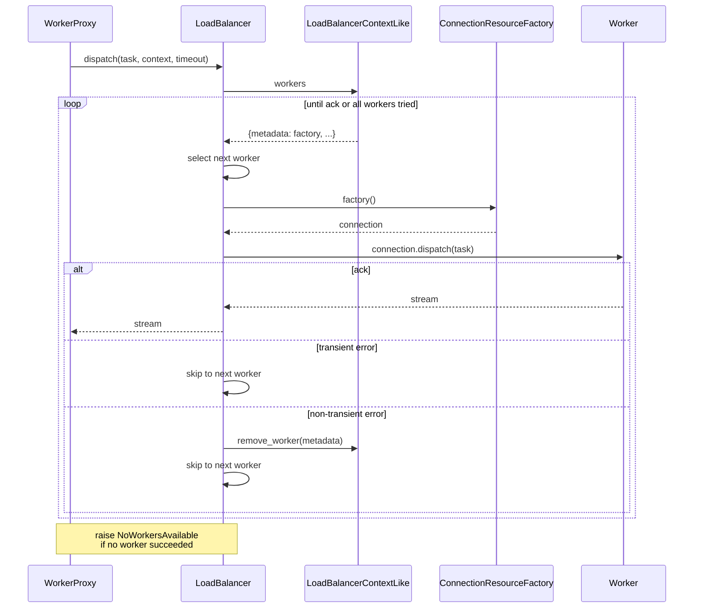

# Load balancing

Load balancing is the dispatch layer between wool routines and workers. When a routine is called, the load balancer decides which worker handles the task. Load balancers operate on a per-pool context rather than owning worker state directly, so a single load balancer instance can service multiple independent pools.

## Context-based dispatch

Every dispatch call receives a `LoadBalancerContextLike` — a protocol defining an isolated container of workers and their connection factories for a specific pool. Each `WorkerPool` maintains its own context, so a single load balancer instance can be reused across multiple pools while keeping dispatch scoped to the correct one. Routines are always routed to the workers belonging to the pool they were called through, regardless of how many share the same load balancer. Discovery events populate the context automatically; the load balancer never needs to know how workers were found, only that they exist.

A `LoadBalancerContextLike` exposes a read-only view of its workers (each mapped to a `ConnectionResourceFactory`) and methods for adding, updating, and removing workers.

## Built-in load balancer

Wool ships with `RoundRobinLoadBalancer`, the default when no load balancer is explicitly specified.

`RoundRobinLoadBalancer` cycles through the workers in a context, advancing the index after each dispatch. When a dispatch attempt fails, the error type determines what happens next:

| Error type     | Behavior                                          |
| -------------- | ------------------------------------------------- |
| Transient      | Worker stays in the context and the next worker is attempted. |
| Non-transient  | Worker is removed from the context and the next worker is attempted. |

If every worker fails or the context is empty, `NoWorkersAvailable` is raised.

## Composability — bring your own load balancer

Wool supports custom load balancers via structural subtyping.

`WorkerPool` accepts `LoadBalancerLike` or `Factory[LoadBalancerLike]` for its `loadbalancer` parameter. The `Factory` type alias covers bare instances, context managers, async context managers, callables, and awaitables — the runtime manages it automatically.

This means you can pass a load balancer instance directly, wrap it in a context manager for lifecycle management, or provide a factory callable — `WorkerPool` handles all cases.

### `LoadBalancerLike` protocol

Custom load balancers implement a single method:

```python
class LoadBalancerLike(Protocol):
    async def dispatch(
        self,
        task: Task,
        *,
        context: LoadBalancerContextLike,
        timeout: float | None = None,
    ) -> AsyncGenerator: ...
```

### Implementing a custom load balancer

A sketch of a priority-based load balancer that routes tasks to the least-loaded worker:

```python
import wool


class LeastLoadedBalancer:
    """Dispatches tasks to the worker with the fewest in-flight tasks."""

    def __init__(self):
        self._in_flight: dict[str, int] = {}

    async def dispatch(
        self,
        task: wool.Task,
        *,
        context: wool.LoadBalancerContextLike,
        timeout: float | None = None,
    ):
        if not context.workers:
            raise wool.NoWorkersAvailable("No workers available")

        # Pick the worker with the lowest in-flight count
        metadata, factory = min(
            context.workers.items(),
            key=lambda item: self._in_flight.get(item[0].uid, 0),
        )

        self._in_flight[metadata.uid] = (
            self._in_flight.get(metadata.uid, 0) + 1
        )
        try:
            async with factory() as connection:
                return await connection.dispatch(task, timeout=timeout)
        finally:
            self._in_flight[metadata.uid] -= 1
```

## Usage examples

### Default load balancer

When no `loadbalancer` argument is provided, `WorkerPool` uses `RoundRobinLoadBalancer`:

```python
import wool

async with wool.WorkerPool(size=4) as pool:
    result = await my_routine()
```

### Custom load balancer

Pass any `LoadBalancerLike` instance (or factory) to `WorkerPool`:

```python
import wool

balancer = LeastLoadedBalancer()

async with wool.WorkerPool(size=4, loadbalancer=balancer) as pool:
    result = await my_routine()
```

## How it fits together


