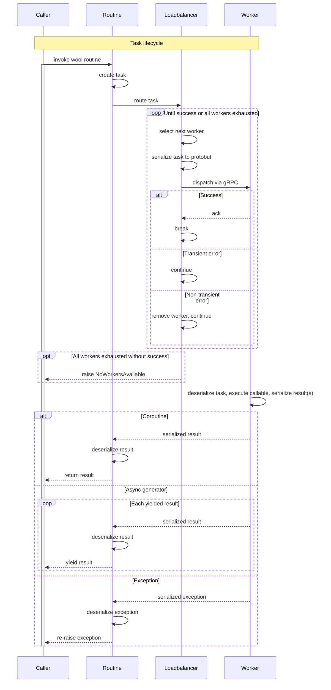

# Wool routines

A Wool routine is an async function decorated with `@wool.routine` that can be executed on remote workers. The decorator converts a normal coroutine or async generator into a distributable task — when called, the function is serialized and dispatched to a worker in the pool, with the result(s) streamed back to the caller.

## `@wool.routine` decorator

The `routine` decorator is the primary entry point. It wraps an async function so that calls are intercepted and routed to the worker pool:

```python
@wool.routine
async def fib(n: int) -> int:
    if n <= 1:
        return n
    async with asyncio.TaskGroup() as tg:
        a = tg.create_task(fib(n - 1))
        b = tg.create_task(fib(n - 2))
    return a.result() + b.result()
```

Async generators are also supported for streaming results:

```python
@wool.routine
async def fib(n: int):
    a, b = 0, 1
    for _ in range(n):
        yield a
        a, b = b, a + b
```

The decorated function, its arguments, returned or yielded values, and exceptions must all be serializable via `cloudpickle`. Avoid unpicklable objects like open file handles, database connections, and locks.

Instance, class, and static methods are all supported. Decorator order does not matter.

## Task dataclass

`Task` is the unit of work in the Wool runtime. Each Wool routine call produces a `Task` containing:

- **id** — unique UUID
- **callable** — the function to execute
- **args / kwargs** — serialized arguments
- **proxy** — the `WorkerProxyLike` that dispatches it, enbables nested routines
- **caller** — parent task UUID for nested task tracking, `None` for root tasks
- **timeout** — execution timeout in seconds

Tasks are serialized to protobuf for gRPC transmission (`to_protobuf` / `from_protobuf`) using `cloudpickle` for the callable and its arguments.

## Task lifecycle events

Wool provides task lifecycle hooks in the form of events that can be intercepted with event handlers. Handlers are executed on a dedicated thread to avoid blocking the main event loop. `TaskEvent` is an `Event` subclass that carries a reference to the associated `Task`. Register handlers with the decorator:

```python
@wool.TaskEvent.handler("task-created", "task-completed")
def on_task(event: wool.TaskEvent, timestamp: int, context=None) -> None:
    ...
```

`TaskEventType` defines the valid event type literals:

| Event type         | When emitted                                |
| ------------------ | ------------------------------------------- |
| `task-created`     | Task dataclass is instantiated.             |
| `task-scheduled`   | Worker service begins executing the task.   |
| `task-started`     | Asyncio handle enters the task's context.   |
| `task-stopped`     | Asyncio handle exits the task's context.    |
| `task-completed`   | Asyncio task finishes (success or failure). |

`TaskEventHandler` is the protocol for handler callables.

## Task exceptions

When a task raises during execution, the exception is captured as a `TaskException` dataclass with two fields:

- **type** — qualified name of the exception class (e.g., `"ValueError"`)
- **traceback** — list of formatted traceback lines

This is set on `task.exception`.

## Routine dispatch sequence


