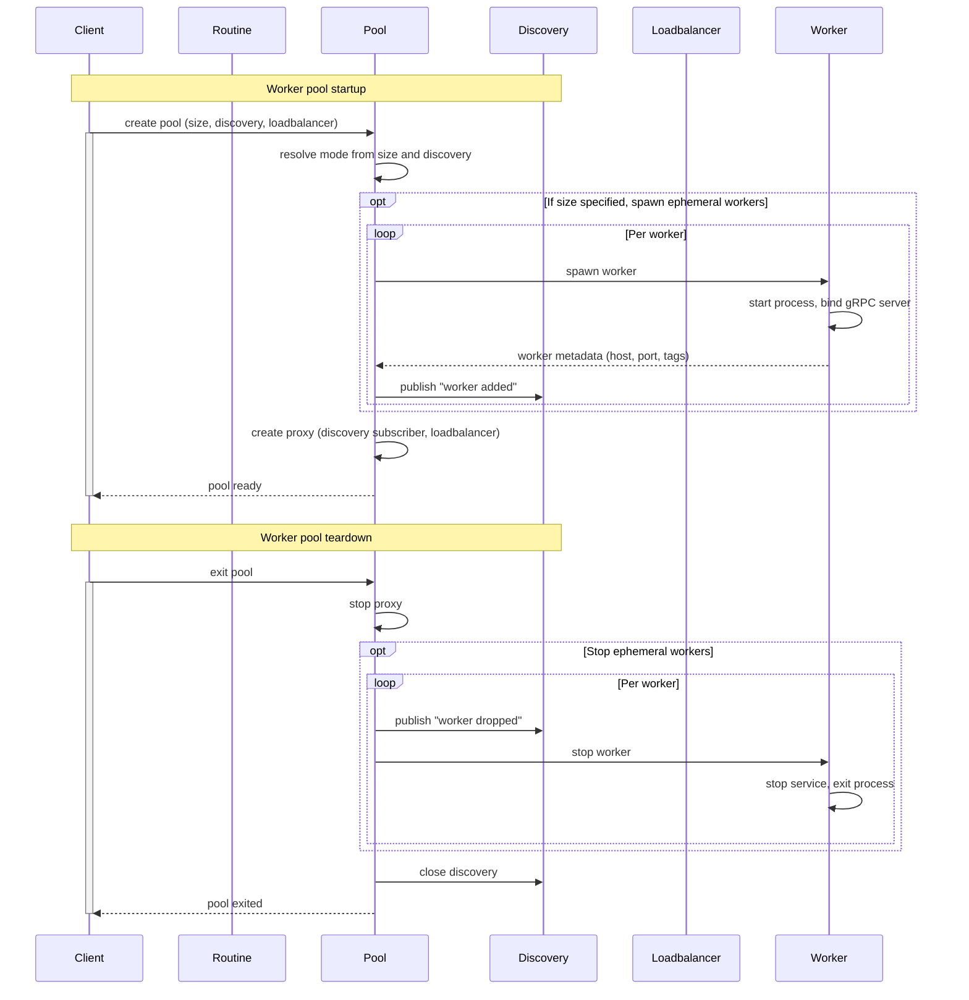

# Workers

Workers are the execution layer where `@wool.routine` calls actually run. Each worker is an isolated subprocess hosting a gRPC server with its own asyncio event loop. The `WorkerPool` orchestrates their lifecycle — starting, stopping, and publishing them to discovery. Internally, the pool uses a `WorkerProxy` to route dispatched tasks across workers through a load balancer.

## Pool modes

`WorkerPool` supports four configurations depending on which arguments are provided:

| Mode | `size` | `discovery` | Behavior |
| ---- | ------ | ----------- | -------- |
| Default | omitted | omitted | Spawns `cpu_count` local workers with internal `LocalDiscovery`. |
| Ephemeral | set | omitted | Spawns N local workers with internal `LocalDiscovery`. |
| Durable | omitted | set | No workers spawned; connects to existing workers via discovery. |
| Hybrid | set | set | Spawns local workers and discovers remote workers through the same protocol. |

**Default** — no arguments needed:

```python
import wool

async with wool.WorkerPool():
    result = await my_routine()
```

**Ephemeral** with tags — spawn local workers:

```python
import wool

async with wool.WorkerPool("gpu-capable", size=4):
    result = await gpu_task()
```

**Durable** — connect to workers already running on the network:

```python
import wool

async with wool.WorkerPool(discovery=wool.LanDiscovery()):
    result = await my_routine()
```

**Hybrid** — spawn local workers and discover remote ones:

```python
import wool

async with wool.WorkerPool(size=4, discovery=wool.LanDiscovery()):
    result = await my_routine()
```

*Note: `size` controls how many workers are spawned by the pool — it does not cap the total number of workers available. In Hybrid mode, additional workers may join via discovery beyond the initial `size`.*

## Worker lifecycle

`WorkerLike` is the protocol that defines the worker interface. Wool's built-in implementations use the `Worker` ABC, which provides a template-method pattern: the public `start()` and `stop()` methods are `@final`, enforce precondition checks, and delegate to abstract `_start()` and `_stop()` hooks. Custom implementations do not need to extend `Worker`; they only need to satisfy `WorkerLike`.

`WorkerLike` properties:

| Property | Type | Description |
| -------- | ---- | ----------- |
| `uid` | `UUID` | Unique identifier assigned at construction. |
| `metadata` | `WorkerMetadata \| None` | Full metadata including address, tags, and version. `None` before `start()`. |
| `tags` | `set[str]` | Capability tags for filtering and selection. |
| `extra` | `dict[str, Any]` | Arbitrary key-value metadata. |
| `address` | `str \| None` | gRPC target address (e.g. `"host:port"`, `"unix:path"`). `None` before `start()`. |

`LocalWorker` is the built-in implementation:

- **start**: Spawns a `WorkerProcess` subprocess. The subprocess creates a gRPC server, binds to the configured host and port (port 0 selects an available port), and sends the actual port back to the parent via a multiprocessing pipe. The parent constructs `WorkerMetadata` from the resolved address.
- **stop**: Sends a gRPC `stop` RPC to the subprocess. The subprocess sets a stopping flag — once set, new dispatches are rejected with `UNAVAILABLE` — then drains or cancels in-flight tasks according to the timeout, stops the gRPC server with a grace period, and exits.

### Custom workers

`WorkerPool` accepts a `WorkerFactory` for its `worker` parameter. The factory protocol is a callable that receives tags and keyword arguments and returns a `WorkerLike`:

```python
class WorkerFactory(Protocol):
    def __call__(self, *tags: str, **_) -> WorkerLike: ...
```

Custom workers need only satisfy the `WorkerLike` protocol and host a gRPC server implementing the worker service protocol at its reported `address`.

The following example extends `LocalWorker` with automatic crash recovery. A background monitor checks `WorkerProcess.is_alive()` periodically and restarts the subprocess if it has exited unexpectedly:

```python
import asyncio
import logging

from wool.runtime.worker.local import LocalWorker
from wool.runtime.worker.process import WorkerProcess

logger = logging.getLogger(__name__)


class ResilientWorker(LocalWorker):
    """LocalWorker that automatically restarts on crash."""

    def __init__(self, *tags, check_interval: float = 5.0, **kwargs):
        super().__init__(*tags, **kwargs)
        self._check_interval = check_interval
        self._monitor_task = None

    async def _start(self, timeout=None):
        await super()._start(timeout=timeout)
        self._monitor_task = asyncio.create_task(self._monitor())

    async def _stop(self, timeout=None):
        if self._monitor_task:
            self._monitor_task.cancel()
            try:
                await self._monitor_task
            except asyncio.CancelledError:
                pass
        await super()._stop(timeout=timeout)

    async def _restart(self):
        """Replace the dead process, reusing the original port."""
        self._worker_process = WorkerProcess(
            host=self._worker_process.host,
            port=self._worker_process.port,
            server_credentials=self._server_credentials,
        )
        loop = asyncio.get_running_loop()
        await loop.run_in_executor(
            None, lambda: self._worker_process.start(timeout=None)
        )
        logger.info("Worker %s restarted at %s", self.uid, self.address)

    async def _monitor(self):
        """Periodically check if the worker process is alive."""
        while True:
            await asyncio.sleep(self._check_interval)
            if not self._worker_process.is_alive():
                logger.warning("Worker %s crashed, restarting", self.uid)
                await self._restart()
```

Plug it into the pool with a factory:

```python
import wool
from functools import partial

async with wool.WorkerPool(
    size=4,
    worker=partial(ResilientWorker, check_interval=10.0),
):
    result = await my_routine()
```

## Task execution

Each worker subprocess has a two-loop architecture:

- The **gRPC event loop** runs the gRPC server (`WorkerService`). It receives dispatch RPCs, sends acknowledgments, and streams results back.
- A dedicated **worker event loop** runs on a daemon thread. Tasks are offloaded here so that long-running work never blocks gRPC operations like health checks or new dispatches.

Context variables are propagated from the gRPC loop to the worker loop. Coroutines use `concurrent.futures.Future` to bridge the result back; async generators stream results via an `asyncio.Queue`.

### Dispatch protocol

The `dispatch` RPC is server-streaming. The response sequence is:

1. **Ack** — confirms the worker accepted the task.
2. **Result(s)** — one result for coroutines, multiple for async generators.
3. **Exception** — if the task raises, the serialized exception replaces the result.

### Shutdown timeout

The `stop` RPC accepts a `timeout` argument that controls how in-flight tasks are handled:

| `timeout` | Behavior |
| --------- | -------- |
| `0` | Cancel all in-flight tasks immediately. |
| `> 0` | Wait up to N seconds, then cancel remaining tasks. |
| `< 0` | Wait indefinitely for all tasks to complete. |

Signal handlers map `SIGTERM` to timeout 0 (cancel immediately) and `SIGINT` to timeout -1 (wait indefinitely).

### Nested routines

Worker subprocesses can dispatch tasks to other workers. Each subprocess is configured with a `ResourcePool` of `WorkerProxy` instances (via `wool.__proxy_pool__`), so `@wool.routine` calls within a task transparently route to the target pool. Spinning up a `WorkerProxy` is not free — it involves establishing a discovery subscription and opening gRPC connections — so the resource pool caches proxies with a configurable TTL (default 60 seconds, set via `proxy_pool_ttl` on `LocalWorker`). If the interval between dispatches for a given pool on a given worker is shorter than the TTL, the cached proxy is reused. If it exceeds the TTL, the proxy is finalized and must be recreated on the next dispatch. Tuning `proxy_pool_ttl` above the expected dispatch interval keeps proxies warm and avoids this cold-start overhead.

## Connections

`WorkerProxy` is the client-side bridge between routines and workers. It manages discovery, connection pooling, and load-balanced dispatch.

### Construction modes

| Mode | Parameter | Description |
| ---- | --------- | ----------- |
| Pool URI | `pool_uri` | Subscribes to `LocalDiscovery` with the URI as namespace and tag filter. |
| Discovery | `discovery` | Accepts any `DiscoverySubscriberLike` or `Factory` thereof. |
| Static | `workers` | Takes a sequence of `WorkerMetadata` directly — no discovery needed. |

### Connection pooling

`WorkerConnection` is a lightweight facade that dispatches tasks over pooled gRPC channels. Channels are cached at the module level in a `ResourcePool` keyed by `(target, credentials, limit)`, with a 60-second TTL — idle channels are finalized after the TTL expires. Each channel enforces semaphore-based concurrency limiting (default 100 concurrent dispatches).

### Error classification

| Error | gRPC codes | Load balancer behavior |
| ----- | ---------- | ---------------------- |
| `TransientRpcError` | `UNAVAILABLE`, `DEADLINE_EXCEEDED`, `RESOURCE_EXHAUSTED` | Retry on next worker. |
| `RpcError` | All others | Remove worker from context, retry next. |

### Security filter

Proxies enforce security compatibility during discovery. A proxy configured with credentials only connects to workers with `secure=True` metadata; a proxy without credentials only connects to `secure=False` workers. This prevents mixed security configurations within a pool.

## Security

`WorkerCredentials` is a frozen dataclass that loads PEM certificates and produces gRPC credentials for both sides of a connection.

| Mode | `mutual` | Server verified | Client verified |
| ---- | -------- | --------------- | --------------- |
| mTLS (default) | `True` | Yes | Yes |
| One-way TLS | `False` | Yes | No |

```python
import wool

creds = wool.WorkerCredentials.from_files(
    ca_path="certs/ca-cert.pem",
    key_path="certs/worker-key.pem",
    cert_path="certs/worker-cert.pem",
    mutual=True,
)

async with wool.WorkerPool(size=4, credentials=creds):
    result = await my_routine()
```

Credential flow: `server_credentials` are passed to spawned workers for their gRPC servers; `client_credentials` are passed to the proxy for outgoing connections and to workers for the stop RPC.

## Worker execution sequence


