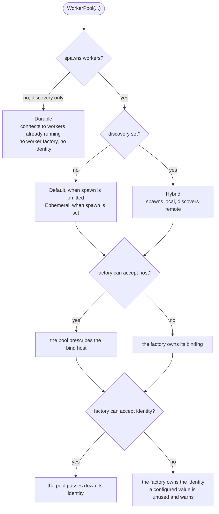

# Workers

Workers are the execution layer where `@wool.routine` calls actually run. Each worker is an isolated subprocess hosting a gRPC server with its own asyncio event loop. The `WorkerPool` orchestrates their lifecycle — starting, stopping, and publishing them to discovery. Internally, the pool uses a `WorkerProxy` to route dispatched tasks across workers through a load balancer.

## Pool modes

`WorkerPool` supports four configurations depending on which arguments are provided:

| Mode | `spawn` | `discovery` | Behavior |
| ---- | ------- | ----------- | -------- |
| Default | omitted | omitted | Spawns `cpu_count` local workers with internal `LocalDiscovery`. |
| Ephemeral | set | omitted | Spawns N local workers with internal `LocalDiscovery`. |
| Durable | omitted | set | No workers spawned; connects to existing workers via discovery. |
| Hybrid | set | set | Spawns local workers and discovers remote workers through the same protocol. |

Which mode a call resolves to follows from two questions; what the pool then passes the factory follows from two more, answered by inspecting the factory's signature rather than by which overload matched:


```mermaid
flowchart TD
    call(["WorkerPool(...)"]) --> spawning{"spawns workers?"}

    spawning -- "no, discovery only" --> durable["Durable<br/>connects to workers already running<br/>no worker factory, no identity"]
    spawning -- yes --> discovers{"discovery set?"}

    discovers -- no --> local["Default, when spawn is omitted<br/>Ephemeral, when spawn is set"]
    discovers -- yes --> hybrid["Hybrid<br/>spawns local, discovers remote"]

    local --> bound{"factory can accept host?"}
    hybrid --> bound

    bound -- yes --> prescribed["the pool prescribes the bind host"]
    bound -- no --> owns["the factory owns its binding"]

    prescribed --> named{"factory can accept identity?"}
    owns --> named

    named -- yes --> passed["the pool passes down its identity"]
    named -- no --> unused["the factory owns the identity<br/>a configured value is unused and warns"]
```

Both signature questions are orthogonal to the mode and to each other — the four combinations are the four shapes `WorkerFactoryLike` admits; see [Custom workers](#custom-workers). `worker` takes the same alias whatever the spawning mode — Durable declares no `worker` at all — so the deprecated `size` overloads mirror the `spawn` ones exactly.

**Default** — no arguments needed:

```python
import wool

async with wool.WorkerPool():
    result = await my_routine()
```

**Ephemeral** with tags — spawn local workers:

```python
import wool

async with wool.WorkerPool("gpu-capable", spawn=4):
    result = await gpu_task()
```

**Durable** — connect to workers already running on the network:

```python
import wool

async with wool.WorkerPool(discovery=wool.LanDiscovery()):
    result = await my_routine()
```

**Hybrid** — spawn local workers and discover remote ones:

```python
import wool

async with wool.WorkerPool(spawn=4, discovery=wool.LanDiscovery()):
    result = await my_routine()
```

> `spawn` controls how many workers are spawned by the pool — it does not cap the total number of workers available. In Hybrid mode, additional workers may join via discovery beyond the initial `spawn`. The `lease` parameter caps how many additional discovered workers the pool will accept. The total pool capacity is `spawn + lease` when both are set. The lease count is a cap on admission, not a reservation — discovered workers may serve multiple pools simultaneously, and there is no guarantee that a leased slot will remain filled for the life of the pool:
>
> ```python
> import wool
>
> # Spawn 4 local workers, accept up to 4 more from discovery (8 total)
> async with wool.WorkerPool(spawn=4, lease=4, discovery=wool.LanDiscovery()):
>     result = await my_routine()
>
> # Durable pool capped at 10 discovered workers
> async with wool.WorkerPool(discovery=wool.LanDiscovery(), lease=10):
>     result = await my_routine()
> ```

## Worker lifecycle

`WorkerLike` is the protocol that defines the worker interface. Wool's built-in implementations use the `Worker` ABC, which provides a template-method pattern: the public `start()` and `stop()` methods are `@final`, enforce precondition checks, and delegate to abstract `_start()` and `_stop()` hooks. Custom implementations do not need to extend `Worker`; they only need to satisfy `WorkerLike`.

`WorkerLike` properties:

| Property | Type | Description |
| -------- | ---- | ----------- |
| `uid` | `UUID` | Unique identifier assigned at construction. |
| `metadata` | `WorkerMetadata \| None` | The worker's advertised record — see `WorkerMetadata` for its fields. `None` before `start()`. |
| `tags` | `set[str]` | Capability tags for filtering and selection. |
| `extra` | `dict[str, Any]` | Arbitrary key-value metadata. |
| `address` | `str \| None` | gRPC target address (e.g., `"host:port"`, `"unix:path"`). `None` before `start()`. |

`LocalWorker` is the built-in implementation:

- **start**: Spawns a `WorkerProcess` subprocess. The subprocess creates a gRPC server, binds to the configured host and port (port 0 selects an available port), and sends the actual port back to the parent via a multiprocessing pipe. The parent constructs `WorkerMetadata` from the resolved address.
- **stop**: Sends a gRPC `stop` RPC to the subprocess. The subprocess sets a stopping flag — once set, new dispatches are rejected with `UNAVAILABLE` — then drains or cancels in-flight tasks according to the timeout, stops the gRPC server with a grace period, and exits.

### Durable workers

A standalone worker deployed to serve off-host, e.g., a container or VM that outlives any one pool, must bind beyond loopback and publish itself:

```python
worker = LocalWorker(host="0.0.0.0")
await worker.start()
async with LanDiscovery("my-pool").publisher as publisher:
    await publisher.publish("worker-added", worker.metadata)
    ...
```

The wildcard bind makes the publisher auto-resolve a routable advertised address (the pod or machine IP). Leaving the worker on its loopback default and publishing it over LAN discovery emits a `LoopbackAdvertisementWarning`, since off-host subscribers cannot reach it.

### Custom workers

`WorkerPool` accepts any of the four shapes `WorkerFactoryLike` admits for its `worker` parameter. They vary along two orthogonal axes (i.e., whether the factory receives the pool's bind `host`, and whether it receives the pool's `identity`), giving `WorkerFactory`, `IdentifiedWorkerFactory`, `BoundWorkerFactory`, and `IdentifiedBoundWorkerFactory`. A factory receiving `host` is handed the bind host prescribed by the pool's discovery publisher, so factory-customized workers stay reachable wherever the publisher advertises them; `LocalWorker` itself qualifies. Which keywords a factory receives, and what it owns instead, is the `WorkerFactoryLike` docstring's to say.

All four shapes take capability tags and a `credentials` keyword accepting a `WorkerCredentials`, a `WorkerCredentialsProvider`, or `None`; see their docstrings for the authoritative signatures.

A factory that *requires* an `identity` when the pool has none configured is refused at construction, since that call could not be made at all.

Custom workers need only satisfy the `WorkerLike` protocol and host a gRPC server implementing the worker service protocol at its reported `address`.

The following example extends `LocalWorker` with automatic crash recovery. A background monitor checks `WorkerProcess.is_alive()` periodically and restarts the subprocess if it has exited unexpectedly:

```python
import asyncio
import logging

from wool.runtime.worker.local import LocalWorker
from wool.runtime.worker.process import WorkerProcess

logger = logging.getLogger(__name__)


class ResilientWorker(LocalWorker):
    """LocalWorker that automatically restarts on crash."""

    def __init__(self, *tags, check_interval: float = 5.0, **kwargs):
        super().__init__(*tags, **kwargs)
        self._check_interval = check_interval
        self._monitor_task = None

    async def _start(self, timeout=None):
        await super()._start(timeout=timeout)
        self._monitor_task = asyncio.create_task(self._monitor())

    async def _stop(self, grace=None):
        if self._monitor_task:
            self._monitor_task.cancel()
            try:
                await self._monitor_task
            except asyncio.CancelledError:
                pass
        await super()._stop(grace=grace)

    async def _restart(self):
        """Replace the dead process, reusing the original port."""
        self._worker_process = WorkerProcess(
            host=self._worker_process.host,
            port=self._worker_process.port,
            credentials=self._provider,
        )
        loop = asyncio.get_running_loop()
        await loop.run_in_executor(
            None, lambda: self._worker_process.start(timeout=None)
        )
        logger.info("Worker %s restarted at %s", self.uid, self.address)

    async def _monitor(self):
        """Periodically check if the worker process is alive."""
        while True:
            await asyncio.sleep(self._check_interval)
            if not self._worker_process.is_alive():
                logger.warning("Worker %s crashed, restarting", self.uid)
                await self._restart()
```

Plug it into the pool with a factory:

```python
import wool
from functools import partial

async with wool.WorkerPool(
    spawn=4,
    worker=partial(ResilientWorker, check_interval=10.0),
):
    result = await my_routine()
```

## Task execution

Each worker subprocess has a two-loop architecture:

- The **gRPC event loop** runs the gRPC server (`WorkerService`). It receives dispatch RPCs, sends acknowledgments, and streams results back.
- A dedicated **worker event loop** runs on a daemon thread. Routines are scheduled here so that long-running work never blocks gRPC operations. The pools a routine draws on — the proxy pool and the discovery-subscriber pool — are bound to this loop and are finalized on it when the loop retires; a `ResourcePool` serves one running loop at a time.

Per-dispatch, the gRPC handler instantiates a `DispatchSession` — an async context manager and async iterator that owns the dispatch's full worker-side lifecycle as a uniform driver for both coroutine and async-generator Wool routines. The session has four phases:

1. **Parsing** (`__aenter__`) — reads the first request frame, decodes the caller's chain manifest and rebuilds the `wool.Task` (both via `cloudpickle`), and validates the routine type. Failures wrap in `Rejected` and surface via a `Nack` carrying the typed exception (see _Exception flow_ below).
2. **Iteration** (`__aiter__`) — schedules the worker driver lazily on first call so the handler's pre-iteration decisions (i.e., backpressure hook) run before the worker task installs the work context on its own thread. The worker driver enters a routine-scoped context manager for the parsed task and drives the routine iteratively, with the cross-loop bridge mediated by a pair of queues. Coroutine Wool routines synthesize a single `next` request internally; async-generator routines are driven by iteration commands issued by the client, mirroring the standard library's async-generator semantics.
3. **Teardown** (`__aexit__`) — drains the worker driver and unwinds the exit stack. Drain is registered as an exit-stack callback so resource release runs even if drain itself raises.
4. **Cancellation** (`cancel`) — sets a flag observed by both the iteration loop and the deferred scheduler, cancels the worker driver task on the worker loop so a routine suspended inside an `await` receives `CancelledError`, and pushes an end-of-stream frame onto the response queue. Cancellation is idempotent and cross-task safe (no `aclose` of the iterator, so a `cancel` call from any task — including the service's preemption path during graceful shutdown — does not race the driving task).

The dispatch handler decodes the chain manifest into a `ChainManifest` inside the session's parse phase. The worker driver task's first action is to install that chain manifest — re-stamped so the worker-loop thread owns the chain — and the routine then runs under it. When the decoded caller frame carries no state, the mount is skipped — the worker task runs unarmed, matching the armed-gating contract documented in `context/README.md`. A later mid-stream frame with state arms lazily through the `Frame.mount` pipeline inside `_drive_step`. After each step the worker publishes the post-step chain manifest onto the session so the handler can encode it for back-propagation; the handler reads it only after draining the worker, so the cross-thread read is race-free.

### Chain-manifest decode failures

The chain manifest is **ancillary state** in Wool's protocol contract: a failure to decode an incoming chain manifest — whether on the initial dispatch frame, a mid-stream frame, or a back-propagated response — never preempts the routine's primary signal (its return value or raised exception). The worker's contract on each side:

- **Initial-frame decode failure (request).** In non-strict mode each unreadable entry is dropped with a `wool.SerializationWarning` and the routine runs under whatever partial chain manifest decoded; an empty or entirely-unreadable frame leaves the worker context unarmed. In strict mode the promoted warnings aggregate into a `wool.ChainSerializationError` that is shipped via the `Nack` channel — the routine does not run.
- **Mid-stream decode failure (request).** In non-strict mode each unreadable entry is dropped with a `wool.SerializationWarning` and the surviving partial chain manifest is still merged into the active work context before the step proceeds. In strict mode the promoted warnings aggregate into a `wool.ChainSerializationError` that propagates out of the step as the routine's terminal failure — shipped via the routine-exception channel, just like any other routine-time exception.
- **Chain-manifest encode failure (response).** The back-propagated chain manifest is replaced with an empty chain manifest; the response still carries the routine's result or exception. A `wool.SerializationWarning` is emitted on the worker. When a strict-mode encode failure coincides with a routine exception, the resulting `wool.ChainSerializationError` is chained onto the routine exception via `raise routine_exc from encode_err` so the caller's traceback shows both signals.

The caller side mirrors this contract: response chain-manifest decode failures emit `wool.SerializationWarning` on the caller and never preempt the routine's outcome. See the top-level [`wool/README.md`](../../../../README.md#decode-failure-semantics) for the full lenient/inspect/strict modes.

Worker-side strict mode is enabled via Python's standard `PYTHONWARNINGS` environment variable (which `multiprocessing` propagates to spawned worker subprocesses by default). When the worker promotes the warning to an exception, the dispatch handler catches it before the routine starts and ships it via the routine-exception channel, so the caller observes a `wool.SerializationWarning` raised — symmetric with caller-side strict mode rather than a generic gRPC error. Promotions raised after the routine starts surface through the existing routine-exception machinery.

### Exception flow

Worker-side failures route through one of three exit channels. See the top-level [_Error handling_](../../../../README.md#error-handling) section for the full caller-side picture across all dispatch phases.

| Source | Surface | Caller observes |
| ------ | ------- | --------------- |
| Parse-phase failure (`Rejected` from `__aenter__`) | `Nack` frame with cloudpickled `original` exception | Original exception re-raised, type and traceback preserved |
| Routine-time exception (raised inside `_drive_step`) | Terminal `Response.exception` with cloudpickle-dumped exception + post-step chain manifest | Original exception re-raised, type and traceback preserved |
| Handler-level encoding failure (result dump fails, strict-mode chain-manifest encode raises) | Same terminal `Response.exception` channel; either ships the encode failure directly (result dump) or chains the resulting `wool.ChainSerializationError` onto the routine exception's `__cause__` via `raise ... from` (chain-manifest encode during routine exception) | Either the encode failure or the routine exception with the encode failure on `__cause__` |

`VersionInterceptor` aborts incoming requests with `FAILED_PRECONDITION` before the dispatch handler runs; that surfaces on the caller as a non-transient `RpcError` and is **not** routed through the `Nack` channel.

The `Nack` frame's purpose is to ship a typed parse-phase exception so the caller observes the **actual failure class** rather than an opaque RPC error. A `Nack` only appears pre-Ack; once the dispatch handler yields an `Ack`, all further terminal signals ride on `Response.exception`. The dispatch FSM is `Ack? (Result* (Exception | ε)) | Nack`.

Operator-initiated cancellation (graceful shutdown) flows through the routine-exception channel: `WorkerService._preempt` invokes `DispatchSession.cancel` on every in-flight dispatch, the worker task is cancelled on the worker loop, and `CancelledError` rides on the terminal frame. The caller's `await routine()` raises `CancelledError` — indistinguishable from caller-initiated or routine-self-cancellation, matching stdlib's `await task` semantics.

### Dispatch protocol

The `dispatch` RPC is bidirectional-streaming. Both coroutines and async generators share the same stream, but differ in how iteration proceeds:

- **Coroutines** — the server sends an ack followed by a single result (or exception). The client does not write after the initial request.
- **Async generators** — the server sends an ack, then the client drives each iteration by writing a command frame (`next`, `send`, or `throw`). The server advances the generator and responds with the yielded value (or exception) before waiting for the next command. The generator advances only on receipt of a client command.

### Shutdown timeout

The `stop` RPC accepts a `timeout` argument that controls how in-flight tasks are handled:

| `timeout` | Behavior |
| --------- | -------- |
| `0` | Cancel all in-flight tasks immediately. |
| `> 0` | Wait up to N seconds, then cancel remaining tasks. |
| `< 0` | Wait indefinitely for all tasks to complete. |

Signal handlers map `SIGTERM` to timeout 0 (cancel immediately) and `SIGINT` to timeout -1 (wait indefinitely).

### Nested routines

Worker subprocesses can dispatch tasks to other workers. Each subprocess is configured with a `ResourcePool` of `WorkerProxy` instances (via `wool.__proxy_pool__`), so `@wool.routine` calls within a task transparently route to the target pool. Spinning up a `WorkerProxy` is not free — it involves establishing a discovery subscription, starting a worker-sentinel task (a background coroutine that keeps the proxy's connection context alive), and opening gRPC connections — so the resource pool caches proxies with a configurable TTL (default 60 seconds, set via `proxy_pool_ttl` on `LocalWorker`). If the interval between dispatches for a given pool on a given worker is shorter than the TTL, the cached proxy is reused. If it exceeds the TTL, the proxy is finalized and must be recreated on the next dispatch. The proxy pool is bound to the worker event loop that dispatches through it, so proxies are also finalized when that loop retires after its own idle TTL; a proxy is reused only while the interval between dispatches is shorter than both. Tuning `proxy_pool_ttl` above the expected dispatch interval keeps proxies warm and avoids this cold-start overhead.

Proxies on worker subprocesses are lazy by default — the `WorkerPool` propagates its `lazy` flag to every `WorkerProxy` it constructs, and each task serializes the proxy (including the flag) so that workers receiving the task inherit the same laziness setting. A lazy proxy defers discovery subscription and worker-sentinel task setup until its first `dispatch()` call, so workers that never invoke nested routines pay no startup cost.

### Concurrent-entry guard

`wool.__proxy__` — the active proxy a nested `@wool.routine` reads to dispatch — is a plain `contextvars.ContextVar`, so it is invisible to the [chain-contention guard](../context/README.md#the-chain-contention-guard). To stop two tasks that share one `contextvars.Context` from silently clobbering each other's proxy (last-write-wins, so both dispatch through the wrong proxy), `WorkerProxy.__aenter__` arms a guarded marker (`WorkerProxy._armed`, a `wool.ContextVar`) before binding the proxy, so a contended second entry fails loud instead of corrupting the first task's dispatch — see `WorkerProxy.__aenter__` for the precise contract. A consequence is that entering a proxy with `async with` arms the chain, even when the routine sets no `wool.ContextVar` of its own. Only the `async with` path arms: the worker pool binds `wool.__proxy__` through `enter()` directly, which deliberately leaves the chain unarmed.

## Connections

`WorkerProxy` is the client-side bridge between routines and workers. It manages discovery, connection pooling, and load-balanced dispatch.

### Construction modes

| Mode | Parameter | Description |
| ---- | --------- | ----------- |
| Pool URI | `pool_uri` | Subscribes to `LocalDiscovery` with the URI as namespace and tag filter. |
| Discovery | `discovery` | Accepts any `DiscoverySubscriberLike` or `Factory` thereof. |
| Static | `workers` | Takes a sequence of `WorkerMetadata` directly — no discovery needed. |

### Lazy startup

`WorkerProxy` accepts a `lazy` parameter (default `True`) that controls when the proxy actually starts — i.e., when it subscribes to discovery, launches the worker sentinel task, and initializes the load balancer context.

| `lazy` | `enter()` / `__aenter__` | `dispatch()` | `exit()` on un-started proxy |
| ------ | ------------------------ | ------------- | ----------------------------- |
| `True` | Sets context var only | Calls `start()` on first call (retrying on a later call if it failed), then dispatches | No-op (safe to call) |
| `False` | Sets context var, calls `start()` | Raises `RuntimeError` if not started | Raises `RuntimeError` |

When `lazy=True`, concurrent `dispatch()` calls use a double-checked lock to ensure the proxy starts exactly once. The `lazy` flag is preserved through `cloudpickle` serialization, so proxies sent to worker subprocesses as part of a task retain their laziness setting.

### Context lifecycle

Both `WorkerPool` and `WorkerProxy` are **single-use** async context managers. Once entered and exited, the same instance cannot be entered again — create a new instance instead. Attempting to call `enter()` or `__aenter__()` a second time raises `RuntimeError`. This prevents silent state corruption from reentrant or repeated context usage (e.g., accidentally nesting `async with proxy:` blocks or calling `enter()` in a retry loop).

```python
# Correct — one instance per context
async with wool.WorkerPool(spawn=4):
    await my_routine()

# Need another pool? Create a new instance.
async with wool.WorkerPool(spawn=4):
    await my_routine()
```

### Self-describing connections

Workers are self-describing: each worker advertises its gRPC transport configuration via `ChannelOptions` in its `WorkerMetadata`. When a client discovers a worker, it reads the advertised options and configures its channel to match — message sizes, keepalive intervals, concurrency limits, and compression are all set automatically. There is no separate client-side configuration step; the worker's metadata is the single source of truth for how to connect to it.

### Connection pooling

`WorkerConnection` is a lightweight facade that dispatches tasks over pooled gRPC channels. Channels are cached at the module level in a `ResourcePool` keyed by `(target, credentials, options, peer)`, with a 60-second TTL — idle channels are finalized after the TTL expires. The pool serves one running event loop at a time: a process that runs successive loops gets a fresh channel set per loop, channels left by a loop that is no longer running are dropped without being closed, and using the pool from two running loops at once raises. Keying on the `WorkerCredentials` value (a frozen dataclass, so hashable and value-equal) is what makes rotation observable at the channel layer — see [Credential providers: admission and rotation](#credential-providers-admission-and-rotation). Each channel's concurrency semaphore is sized by the worker's advertised `max_concurrent_streams` — the client-side dispatch gate. The worker's own HTTP/2 `MAX_CONCURRENT_STREAMS` ceiling is set to twice that value to absorb transient permit-turnover overshoot without faulting the connection. See issue #290.

### Idle reporting

`WorkerConnection.idle` polls how long the remote worker has been continuously idle, returning the duration in seconds. It wraps `rpc idle (Void) returns (Idle)` on the worker's gRPC service; the response is a `wool.protocol.Idle` carrying a single `seconds` field. The optional `timeout` is the gRPC deadline for the poll itself and must be positive — `None`, the default, applies no deadline. The call draws a channel from the same pool a dispatch would, inheriting the connection's credential and secure-channel handling.

Idle is measured as the time since the worker's in-flight task set last emptied, with worker startup counting as the initial empty state. It reads `0.0` while any task is in flight and restarts from zero each time the set drains again, so the value answers "how long has this worker had nothing to do", not "how long since it was started". The measurement is taken on a monotonic clock, so a wall-clock adjustment cannot distort it. Polling creates no `DispatchSession` and never enters the in-flight set, so reading the measurement cannot disturb it.

This is worker idleness, not channel idleness: the 60-second `ResourcePool` TTL above and `WorkerOptions.max_connection_idle_ms` govern how long an unused *channel* survives within the loop that opened it, and neither is affected by whether the worker at the other end is executing tasks.

A worker that predates the idle capability answers the RPC with gRPC `UNIMPLEMENTED`, which surfaces as `IdleUnavailable`. It descends from `WoolError` rather than `RpcError`, so `except RpcError` does not catch it — an absent capability is not an RPC-health fault, and a polling client should treat it as "idle reporting is unavailable on this worker" rather than as a transient hiccup or an unhealthy peer. Every other gRPC failure classifies as it does for dispatch: transient codes raise `TransientRpcError`, everything else raises `RpcError`.

### Transport configuration

Transport options are split into two tiers:

- **`ChannelOptions`** — settings workers advertise via `WorkerMetadata` so clients connect with compatible settings. Includes message sizes (`max_receive_message_length`, `max_send_message_length`), keepalive (`keepalive_time_ms`, `keepalive_timeout_ms`, `keepalive_permit_without_calls`, `max_pings_without_data`), flow control (`max_concurrent_streams`), and compression (`compression`). Most apply symmetrically on both ends; the exception is `max_concurrent_streams`, which sizes the client's dispatch gate while the worker's transport ceiling is set to twice it (see [Connection pooling](#connection-pooling) and issue #290).

- **`WorkerOptions`** — composes a `ChannelOptions` instance with server-only settings that are not communicated to clients: `http2_min_recv_ping_interval_without_data_ms` (minimum allowed client ping interval), `max_ping_strikes` (ping violations before GOAWAY), and optional connection lifecycle limits (`max_connection_idle_ms`, `max_connection_age_ms`, `max_connection_age_grace_ms`).

All options default to gRPC's own defaults. Pass a `WorkerOptions` instance to `LocalWorker` or `WorkerProcess` to customize:

```python
from wool.runtime.worker.base import ChannelOptions, WorkerOptions
from wool.runtime.worker.local import LocalWorker

options = WorkerOptions(
    channel=ChannelOptions(
        keepalive_time_ms=10_000,
        keepalive_timeout_ms=5_000,
        max_concurrent_streams=50,
    ),
    max_connection_idle_ms=300_000,
)

async with wool.WorkerPool(
    spawn=4,
    worker=lambda *tags, credentials=None: LocalWorker(
        *tags, credentials=credentials, options=options,
    ),
):
    result = await my_routine()
```

### Error classification

| Error | gRPC codes | Dispatch behavior |
| ----- | ---------- | ----------------- |
| `TransientRpcError` | `UNAVAILABLE`, `DEADLINE_EXCEEDED`, `RESOURCE_EXHAUSTED` | Skip worker, retry next candidate. |
| `HandshakeError` | `UNAUTHENTICATED`, or `UNAVAILABLE` with TLS evidence | Skip worker without eviction; warn, rate-limited per worker. |
| `RpcError` | All others | Evict worker from context, retry next candidate. |

`HandshakeError` (a `TransientRpcError`) signals that a worker is reachable but the failure carried TLS/mTLS handshake or peer-authentication evidence; the proxy's dispatch loop skips the worker without eviction and logs a per-worker rate-limited warning — see `HandshakeError` for the classification and recoverability contract. A dispatch that drains entirely on handshake failures raises the plain `NoWorkersAvailable`.

The table classifies dispatch-path failures, where the behavior column is the load balancer's response. The idle poll reaches no load balancer and adds one error of its own, `IdleUnavailable` — see [Idle reporting](#idle-reporting).

### Security filter

Proxies enforce security compatibility during discovery. A proxy configured with credentials only connects to workers with `secure=True` metadata; a proxy without credentials only connects to `secure=False` workers. This prevents mixed security configurations within a pool.

## Security

`WorkerCredentials` is a frozen dataclass that loads PEM certificates and produces gRPC credentials for both sides of a connection.

| Mode | `mutual` | Server verified | Client verified |
| ---- | -------- | --------------- | --------------- |
| mTLS (default) | `True` | Yes | Yes |
| One-way TLS | `False` | Yes | No |

```python
import wool

creds = wool.WorkerCredentials.from_files(
    ca_path="certs/ca-cert.pem",
    key_path="certs/worker-key.pem",
    cert_path="certs/worker-cert.pem",
    mutual=True,
)

async with wool.WorkerPool(spawn=4, credentials=creds):
    result = await my_routine()
```

### Credential providers: admission and rotation

`WorkerCredentials` is a fixed set of material, verified against the dialed address. For dynamic-address platforms (Kubernetes, ECS/Fargate) where a worker's address is assigned at startup and credentials are rotated out of band, supply a **credential provider** instead — anywhere `credentials=` is accepted (`WorkerPool`, `LocalWorker`, `WorkerProxy`). A bare `WorkerCredentials` is wrapped in a non-reloadable provider automatically, so existing deployments are unaffected.

A `WorkerCredentialsProvider` is a thin adapter over a `factory` callable returning the current `WorkerCredentials`; it carries the `peers` policy naming which worker names this client accepts — see `WorkerCredentialsProvider`'s `peers` parameter for the accepted shapes and what each admits. It comes in two shapes.

**Fixed material — `WorkerCredentials.as_provider`.** Read or build credentials once, then adapt them, optionally naming the workers this client will accept:

```python
import wool

credentials = wool.WorkerCredentials.from_files(
    ca_path="certs/ca-cert.pem",
    key_path="certs/worker-key.pem",
    cert_path="certs/worker-cert.pem",
)
provider = credentials.as_provider(peers="wool-worker.svc")

async with wool.WorkerPool(
    spawn=4,
    identity="wool-worker.svc",
    credentials=provider,
):
    result = await my_routine()
```

A pool that spawns workers is its own client, so the two must agree: `peers` says which workers this pool will dial and `identity` says what its workers claim to be. Nothing infers one from the other — a pool whose own policy would refuse the workers it starts is refused at construction, or warned about when discovery may still supply acceptable workers from elsewhere.

**Rotating material — `reloadable=True`.** Supply a `factory` the runtime calls to obtain current material, so a long-running fleet adopts rotated certificates without a restart. Wool is unopinionated about *how* you reload — `factory` owns the strategy (re-read a file, poll a secrets manager, cache with a TTL, keep a last-good fallback):

```python
import functools

# Re-read the PEM files each time the factory runs. For an expensive source,
# or to survive a torn read mid-rotation, add caching / last-good fallback here.
factory = functools.partial(
    wool.WorkerCredentials.from_files,
    "certs/ca-cert.pem",
    "certs/worker-key.pem",
    "certs/worker-cert.pem",
)
provider = wool.WorkerCredentialsProvider(
    factory, peers="wool-worker.svc", reloadable=True
)
```

A configured `peers` policy makes a client verify each worker's certificate against a logical name rather than the dialed address — see [Advertised worker identity](#advertised-worker-identity) for where that name comes from. Rotation spans both planes: the client channel pool is keyed by the `WorkerCredentials` value — rotated material is a different key and yields fresh channels, unchanged material reuses pooled ones, and a superseded pooled channel is discarded once its in-flight dispatches drain — and the worker server adopts new material per connection via `grpc.dynamic_ssl_server_credentials`.

A `reloadable=True` `factory` must be **safe to call concurrently** — both the client dispatch path and the worker's per-handshake server fetcher read through it. Reads are cached, so neither path rides on `factory` being cheap and rotation adoption is bounded by the freshness interval plus one factory call; see `WorkerCredentialsProvider.credentials` for what a read costs on each path. An expensive `factory` is still encouraged to return cached material when nothing has changed, since unchanged material reuses pooled channels. A `reloadable=False` provider resolves once at construction and serves that fixed material, so a broken `factory` fails there rather than at the first handshake.

A provider supplied to a worker crosses into the worker subprocess, so its `factory` must survive that trip — see `WorkerCredentialsProvider` for the serialization requirement, which a lambda or closure satisfies. The proxy instead re-resolves its provider from the ambient credential context, so it is never serialized across the dispatch boundary.

### Advertised worker identity

A worker carries an `identity` — a logical name for the workload it is, independent of where it was scheduled — which it advertises through discovery alongside its address. The advertisement is what selects the name a connection verifies — see `WorkerProxy` for the two admission states and what each pins. Reusing the `credentials` loaded above:

```python
provider = credentials.as_provider(peers={"api.wool.svc", "batch.wool.svc"})

async with wool.WorkerPool(
    spawn=4,
    identity="api.wool.svc",
    credentials=provider,
):
    result = await my_routine()
```

The identity must be a name in the worker's certificate, since that is what proves it. Nothing validates the two agree at startup — wool does not parse certificates — so a mismatch surfaces at the first handshake as a `HandshakeError` carrying whatever gRPC's TLS stack reported.

The pool advertises a name its own client accepts, so its workers pass its own admission gate. A predicate accepts a name shape rather than a fixed set:

```python
provider = credentials.as_provider(peers=lambda name: name.endswith(".wool.svc"))
```

The unconfigured admission state is the upgrade path for a fleet that does not yet advertise: roll the workers out with `identity` set first, since a client that configures no `peers` ignores the advertisement, then configure `peers` on the clients once the fleet carries names.

**The advertisement selects which name is verified; it never widens what is accepted.** A worker claiming a name it holds no certificate for passes the admission gate and then fails the handshake. Security therefore does not depend on the discovery plane being trustworthy — only availability does, since forged advertisements cost connection attempts that go nowhere. A deployment wanting to remove even that cost should authenticate its discovery backend; wool's built-in LAN and shared-memory backends do not.

See `WorkerCredentialsProvider`'s `peers` parameter for the direction the policy governs.

### Local self-dispatch socket

For nested routines that dispatch back to the worker's own address, the worker exposes an additional **insecure** Unix-domain-socket port and routes self-dispatch over it (a worker never does TLS against itself). That socket serves the full dispatch service with no transport authentication, so its reachability is confined to the worker's own user by binding it in a uid-confined directory that a respawned worker reclaims — see `WorkerProcess._serve` for the placement and reclaim mechanics. The local host is therefore a trust boundary: any process running as the same uid can dispatch to the worker over the socket. On a shared or multi-tenant host, isolate workers by uid (or container/network namespace) accordingly.

### Discovery-plane trust

Peer-verified mTLS secures the **dispatch** plane; it does not authenticate the **discovery** plane. A worker self-advertises its `WorkerMetadata` over whatever discovery mechanism is in use (LAN multicast, shared-memory, a custom `DiscoveryLike`), none of which is authenticated, so every claim in that record is forgeable by anything that can write to that plane — its `identity` among them. The proxy-side security filter that drops workers whose advertised `secure` flag disagrees with the client's credential posture is therefore a **compatibility gate, not a trust boundary**: it prevents a plaintext/encrypted mismatch, not a malicious advertisement. Actual confidentiality and integrity rest entirely on the mTLS handshake performed when a connection is made — a forged advertisement still cannot complete the handshake without a CA-trusted certificate carrying the name it advertised, which is the name the connection verifies against. The discovery plane is not authenticated; treat discovery as an untrusted hint and the handshake as the trust boundary.
